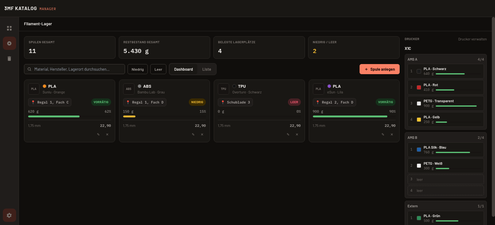
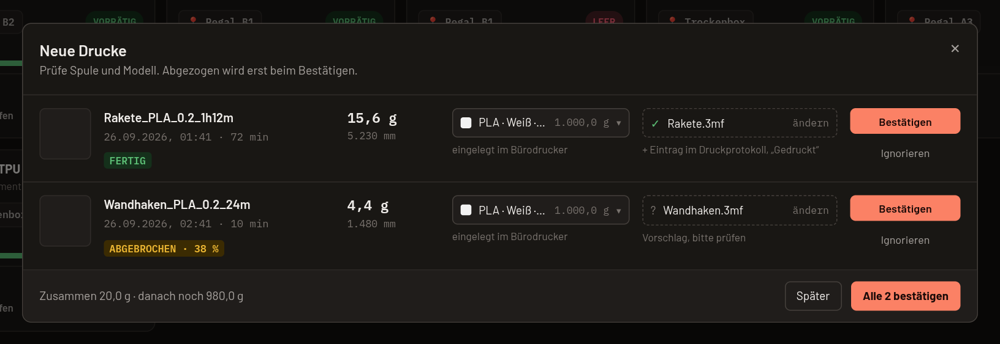

# 3MF Katalog Manager

🇬🇧 **English:** [README in English](README.md)

[](https://github.com/Bexxs75/3mf-katalog-manager/releases/latest) [](https://github.com/Bexxs75/3mf-katalog-manager/actions/workflows/ci-checks.yml) [](https://github.com/Bexxs75/3mf-katalog-manager/releases) [](#download) [](LICENSE) [](https://discord.gg/abfVNfFqu3)

**Deine 3MF-, STL- und STEP-Sammlung wächst? Der 3MF Katalog Manager katalogisiert deine vorhandenen Ordner, findet jedes Modell in Sekunden, zeigt es in 3D und verbindet deine Dateien mit Filament, Druckwarteschlange und Druckprotokoll. Alles bleibt auf deinem Rechner: kein Konto, keine Cloud.**


- **100 % lokal** — keine Anmeldung, keine Cloud, kein Tracking. Deine Dateien bleiben, wo sie sind.
- **Deine vorhandenen Ordner, durchsuchbar** — Ordner importieren, automatische Tags, echte 3D-Vorschau und Slicer-Daten (Gewicht, Filament je Platte).
- **Mehr als ein Dateibrowser** — Filament- und Resin-Lager mit AMS-Fächern, Druckwarteschlange, Druckprotokoll und optionale Anbindung von Klipper-Druckern.

Kostenlos und Open Source (MIT) · Windows, macOS, Linux · Deutsch, Englisch, Spanisch, Französisch · [Webseite](https://3mfkatalog.de) · [Benutzerhandbuch](docs/benutzerhandbuch/BENUTZERHANDBUCH.md)

## Download

[](https://3mfkatalog.de/#download) [](https://3mfkatalog.de/#download) [](https://3mfkatalog.de/#download)

Die Knöpfe öffnen den Download-Bereich der Webseite, dort gibt es immer die neueste Version. Alle Dateien und Prüfsummen: [neueste Version](https://github.com/Bexxs75/3mf-katalog-manager/releases/latest).

**Welche Datei brauche ich?** Windows: die `.msi`. macOS: die `.dmg` (für Intel und Apple Silicon). Linux: das `.AppImage`. Dateien **mit** `-step` im Namen zeigen zusätzlich eine 3D-Vorschau für STEP-Dateien (`.stp`/`.step`) und sind größer; wer nur 3MF, STL oder OBJ nutzt, nimmt die Datei **ohne** `-step`. Sonst sind beide Varianten gleich.

## Kompatibilität

| Bereich | Stand |
|---|---|
| Windows (`.msi`) | verfügbar, unsigniert |
| macOS, Intel und Apple Silicon (`.dmg`) | verfügbar, unsigniert |
| Linux (`.AppImage`) | verfügbar; `.deb`, `.rpm` und AUR geplant |
| 3MF, STL, OBJ | Katalog und 3D-Vorschau |
| STEP (`.stp`/`.step`) | Katalog; 3D-Vorschau mit dem `-step`-Download |
| OrcaSlicer / Bambu Studio 3MF | Filamentverbrauch und Gewicht je Platte unterstützt |
| Im Slicer öffnen | Bambu Studio, OrcaSlicer, PrusaSlicer, SuperSlicer, UltiMaker Cura werden erkannt, weitere lassen sich eintragen |
| Klipper / Moonraker | verfügbar; [weitere Druckermodelle gesucht](https://3mfkatalog.de/druckertest.html) |
| OctoPrint | geplant |
| Bambu Lab (LAN) | geplant, hängt von einem Test an echten Druckern ab |
| PrusaLink | später geplant |
| Sprachen | Deutsch, Englisch, Spanisch, Französisch |

## Ist die Installation sicher?

Windows und macOS zeigen beim ersten Start eine Warnung, weil die Pakete **nicht signiert** sind: Die Zertifikate dafür kosten jedes Jahr Geld, das kann ein kostenloses Hobbyprojekt noch nicht tragen. Die Warnung bedeutet „unbekannter Herausgeber“, nicht, dass etwas Schädliches gefunden wurde.

Was du selbst prüfen kannst:

- **Open Source:** Jede Version wird aus dem öffentlichen Quellcode von [GitHub-Actions-Workflows](https://github.com/Bexxs75/3mf-katalog-manager/tree/master/.github/workflows) gebaut. Der Quellstand jeder Version ist das passende Tag, z. B. [v0.14.0](https://github.com/Bexxs75/3mf-katalog-manager/tree/v0.14.0).
- **Prüfsummen:** Jede Version enthält `SHA256SUMS.txt`. Vergleiche sie mit dem Hash deines Downloads:
  - Windows (PowerShell): `Get-FileHash .\3MF.Katalog.Manager_…msi -Algorithm SHA256`
  - macOS: `shasum -a 256 3MF.Katalog.Manager_…dmg`
  - Linux: `sha256sum -c SHA256SUMS.txt --ignore-missing`
- **Trotzdem starten:** Windows-SmartScreen: „Weitere Informationen“ → „Trotzdem ausführen“. macOS: Rechtsklick auf die App → „Öffnen“; ab macOS 15: Systemeinstellungen → Datenschutz & Sicherheit → „Trotzdem öffnen“.
- **Nur lokal:** Die App arbeitet offline. Online geht sie nur, um auf GitHub nach einer neuen Version zu sehen, und, wenn du es einschaltest, um mit Druckern im Heimnetz zu sprechen.

## Was die App kann

- **Modelle finden und ordnen** — Dateien oder ganze Ordner importieren, automatische Tags, Suche, Ordner, Sammlungen, Favoriten, Duplikaterkennung, Papierkorb.
- **Dateien und Metadaten verstehen** — 3D-Vorschau für 3MF, STL, OBJ (und STEP), Maße, Volumen, Druckplatten, Filamentverbrauch und Gewicht aus OrcaSlicer/Bambu Studio.
- **Filament und Resin verwalten** — Spulen und Resin-Flaschen mit Bestand, Lagerort und Preis, Drucker mit AMS-/MMU-Fächern, „Reicht das Filament?“ je Modell.
- **Drucke planen und dokumentieren** — Warteschlange, Druckstatus, Druckprotokoll mit Fotos, geschätzte Materialkosten, mit einem Klick im Slicer öffnen.
- **Drucker anbinden** — optional und nur lesend: Klipper/Moonraker-Drucker melden den Filamentverbrauch, du bestätigst, dann wird abgebucht. OctoPrint und Bambu Lab sind geplant.
- **Sicher und lokal** — Katalog-Sicherung als ZIP, Archive werden sicher entpackt, Content Security Policy, keine Cloud.

<details>
<summary><b>Alle Funktionen im Detail</b></summary>

- **3MF-, STL-, OBJ- und STEP-Parsing** — 3MF (OPC-Container-Entpackung inkl. eingebettetem Thumbnail), ASCII-/Binär-STL und OBJ jeweils mit 3D-Vorschau; STEP-Dateien (`.stp`/`.step`) werden über Open CASCADE gelesen und liefern 3D-Vorschau, Abmessungen, Volumen und Körperzahl. Für jede Plattform (Linux/Windows/macOS) gibt es zwei Downloads: eine Variante **mit** STEP-Vorschau und eine kleinere Variante **ohne** (nur Katalogisierung ohne 3D-Vorschau für STEP) — siehe [Downloads](#downloads-1).
- **Automatische Metadaten-Extraktion** — Abmessungen, Volumen, Objektanzahl, Material (sofern in der 3MF vorhanden)
- **Automatische Hashtag-Generierung** — Vorschläge aus Dateiname, Geometrie-Merkmalen und Slicer-Profildaten, vom Nutzer editierbar
- **3D-Live-Vorschau** — three.js-Rendering direkt aus der Mesh-Geometrie, wenn kein eingebettetes Thumbnail vorhanden ist
- **Tag- und Ordnerverwaltung**, Suche und Filterung
- **Import** einzelner Dateien oder ganzer Ordner (inkl. Unterordner) per Dialog oder Drag & Drop, über ein gemeinsames Dropdown-Menü in der Kopfzeile
- **Komfort-Ansicht** — alternative, deutlich lesbarere Oberfläche (größere Schrift, Grafiken und Bedienelemente) neben der bestehenden kompakten Ansicht, umschaltbar im Einstellungen-Panel; Favorit-Kennzeichnung je Modell in beiden Ansichten
- **In Slicer öffnen** — beliebig viele selbst hinterlegte Slicer-Programme (herstellerunabhängig) direkt aus dem Katalog heraus starten
- **Mehrsprachige Oberfläche** — Deutsch, Englisch, Spanisch, Französisch, umschaltbar zur Laufzeit
- **Hell-/Dunkel-Theme** mit System-Erkennung und manueller Auswahl, persistiert lokal
- **Filament-Lager** — eigenständige Verwaltung deiner Filamentspulen (Material, Hersteller, Farbe, Lagerort, Durchmesser, Ursprungs-/Restgewicht, Preis) mit Autocomplete für Material/Hersteller/Lagerort, unabhängig vom Modell-Katalog; umschaltbar zwischen Karten-Dashboard (Bestandsbalken, Statusfarbe) und sortierbarer Inventarliste, inkl. Statistik-Leiste und Status-Filter; beim Neuanlegen lassen sich mehrere identische Spulen auf einmal erfassen (jede mit eigenem, unabhängig verfolgtem Restbestand); „＋ Nachkaufen“ auf der Karte bzw. „＋“ in der Listenzeile legt 1 bis 20 neue, volle Spulen mit denselben Daten an; ein Doppelklick auf Karte oder Zeile öffnet das Bearbeiten-Formular; Restgewichte auf 0,1 g genau; Spulenbild per Klick oder Drag & Drop (PNG, JPG oder WebP bis 5 MB); Spulen ohne Bild zeigen in der Liste ein Spulen-Symbol in ihrer Farbe
- **Resin im Lager** — der Umschalter „Filament | Resin“ oben im Filament-Lager wechselt zu deinen Resin-Flaschen: Mengen in ml, eigene Kennzahlen („Flaschen gesamt“), Vorschläge für Resin-Material und -Hersteller, „− Verbrauch“ zum Abbuchen verbrauchter Milliliter und Nachkaufen wie bei Spulen; neue Einträge bekommen die Art des gewählten Bereichs. Resin kommt nie in ein Filament-Fach, sondern nur in die Harzwanne eines Resin-Druckers, und zählt nicht bei „Reicht das Filament?“ und der Materialkosten-Schätzung.
- **Drucker & AMS-Fächer** — Drucker und ihre Mehrfarbeinheiten (Bambu AMS, AMS lite, AMS HT, Creality CFS, Prusa MMU3, Anycubic ACE Pro, Spulenhalter oder eigene mit frei wählbarer Fachanzahl) anlegen und Spulen per Drag & Drop oder Klick in die Fächer legen. Jeder neue Drucker bekommt automatisch einen Spulenhalter, sodass auch Drucker ohne AMS sofort eine Spule aufnehmen. Spulen im Drucker erscheinen getrennt vom Lager in einer eigenen Spalte; beim Herausnehmen kehren sie automatisch an ihren Stammplatz zurück. Spulen haben einen echten Farbwert (Palette oder Hex) zusätzlich zum Farbnamen.
- **Resin-Drucker** — beim Anlegen eines Druckers wählst du „Filament“ oder „Resin“. Ein Resin-Drucker bekommt statt des Spulenhalters eine feste Harzwanne für eine Flasche; du setzt sie per Ziehen oder über das Menü der Wanne ein, siehst Farbe und Rest in ml und buchst mit „− Verbrauch“ ab.
- **Reicht das Filament?** — für geslicete 3MF-Dateien vergleicht die Detailseite den Filamentbedarf mit deinen Spulen (Material und ähnliche Farbe) und zeigt, ob er reicht, nur mit Spulenwechsel reicht oder wie viel fehlt – samt passender Spule und ob sie im Drucker steckt. Die Druck-Warteschlange zeigt den Status je Eintrag und berücksichtigt den Gesamtbedarf.
- **Werkzeuge** — Abschnitt in der Seitenleiste mit Warteschlange, „Zuletzt angesehen“, „Neu hinzugefügt“, „Favoriten“ (alle mit Herz markierten Modelle), „Duplikate“ und Aufräum-Vorschlägen, jeweils mit Anzahl; die Ansichten filtern den Katalog und lassen sich mit Ordnern, Tags und Suche kombinieren.
- **Druckeranbindung** — optional (standardmäßig aus): Klipper/Moonraker-Drucker im Heimnetz melden den Filamentverbrauch fertiger und abgebrochener Drucke; nach deiner Bestätigung wird er von der Spule abgebucht, auf Wunsch mit Druckprotokoll-Eintrag. Nur lesend, nur selbst eingetragene Adressen im Heimnetz. Getestet mit Sovol SV08, Anycubic Kobra S1 (Rinkhals) und Qidi Smart 3; Ergebnisse für weitere Drucker sammelt die [Testseite](https://3mfkatalog.de/druckertest.html).
- **Katalog-Erweiterungen** — Druckstatus-Toggle + Gewicht pro Modell (echter Wert aus dem Slicer, falls die 3mf bereits gesliced wurde, sonst grobe Schätzung aus Volumen × Materialdichte), Sortierung nach "Zuletzt angesehen", NEU-Badge für kürzlich importierte Modelle, Creators-Filter (aus 3MF-Designer-Metadatum), automatische Erkennung exakter Datei-Duplikate beim Import per Inhalts-Hash
- **Filamentverbrauch aus dem Slicer** — liest den in OrcaSlicer/Bambu Studio gesliceten Filamentverbrauch (`Metadata/slice_info.config`) mit aus: reales Gewicht statt Schätzung, Aufschlüsselung pro Druckplatte und Filament (Typ, Farbe, Gramm, Meter) auf der Modell-Detailseite; Button "Metadaten neu einlesen" holt die Werte nachträglich, wenn eine bereits katalogisierte Datei in OrcaSlicer/Bambu Studio nachgesliced wurde
- **Materialkosten-Schätzung** — bei Modellen mit echtem Slicer-Filamentverbrauch zusätzlich eine geschätzte Materialkosten-Summe auf der Detailseite, berechnet aus Verbrauch und den Preisen passender Spulen im Filament-Lager
- **Druckprotokoll** — zusätzlich zum Druckstatus-Toggle ein Protokoll mehrerer Druckversuche pro Modell (Datum, Notiz, Foto), unabhängig vom Druckstatus
- **Katalog-Backup** — kompletter Katalog (Datenbank + Einstellungen) als ZIP exportierbar und wieder importierbar, mit automatischer Sicherung der bestehenden Datenbank vor jedem Import
- **Archive direkt entpacken** — einzeln importierte oder hineingezogene Archive (`.zip`, `.7z`, `.rar`, `.tar`, `.tar.gz`/`.tgz`, `.tar.bz2`, `.tar.xz`, `.tar.zst`) werden nach Rückfrage in einen Unterordner entpackt und die enthaltenen Modelle katalogisiert. Zielordner, Umgang mit bereits vorhandenen Ordnern und das Löschen des Original-Archivs entscheidest du im Dialog; nichts wird überschrieben. Aus Sicherheitsgründen werden Programme, Skripte und Verknüpfungen aus Archiven nie entpackt. Passwortgeschützte und mehrteilige Archive werden erkannt, aber nicht entpackt.
- **Modell-Thumbnails** — Raster-Ansicht zeigt ein echtes Bild pro Modell (eigenes Upload, eingebettetes 3MF-Thumbnail oder automatisch aus der 3D-Live-Vorschau erzeugter Snapshot), zusätzlich pro Modell eine Quelle als Link hinterlegbar
- **Warteschlange** — geordnete, per Drag & Drop sortierbare Liste ("als Nächstes drucken") in eigener Sidebar-Sektion, automatisches Entfernen beim Markieren als gedruckt
- **Aufräum-Vorschläge** — manuell auslösbarer Katalog-Scan findet verwaiste Dateipfade und Bestands-Duplikate, Bereinigung per Auswahl-Dialog
- **Modell-Detailseite** — vollflächige Ansicht (Doppelklick auf ein Modell) mit großer 3D-Vorschau, allen Metadaten und Druckplatten-Anzahl bei Bambu-Studio-/OrcaSlicer-Dateien; eigene Dreh-Steuerelemente (Auto-Rotation + 15°-Schritt-Buttons) zusätzlich zum freien Maus-Ziehen
- **Papierkorb** — gelöschte Modelle bleiben 7 Tage wiederherstellbar statt sofort entfernt zu werden, eigene Ansicht mit Mengen-Badge
- **Mehrfachauswahl** — Checkboxen in der Katalogübersicht, "Alle auswählen", Aktionsleiste für Warteschlange/Sammlung/Druckstatus/Tags/Löschen über mehrere Modelle gleichzeitig
- **Tastaturkürzel** — `/` fokussiert die Suche, Pfeiltasten navigieren räumlich im Raster (Hoch/Runter springt zur nächsten Zeile), Leertaste schaltet die Mehrfachauswahl-Checkbox um, Entf/Rücktaste öffnet bei aktiver Mehrfachauswahl die Löschen-Bestätigung
- **Umbenennen** — Modelle direkt per Kontextmenü umbenennen; die Dateiendung bleibt dabei fest
- **Automatische Slicer-Erkennung** — durchsucht beim Start bekannte Installationsorte (Bambu Studio, OrcaSlicer, PrusaSlicer, SuperSlicer, UltiMaker Cura auf Linux/Windows) und ergänzt Treffer automatisch; manuelles Hinzufügen für Custom-Forks bleibt möglich
- **Bevorzugte Ansicht** — Einstellung, ob Katalog und Detailseite standardmäßig das eingebettete Datei-Bild oder eine gerenderte 3D-Ansicht zeigen; fehlende Schnappschüsse werden bei Bedarf automatisch im Hintergrund nachgerendert
- **Sammlungen** — dritter Organisationsmechanismus neben Ordnern und Tags: mehrere Modelle explizit zu einem Projekt zusammenfassen, mit manuell festlegbarer Reihenfolge (Drag & Drop); Erstellung über Mehrfachauswahl
- **Eigenes App-Icon** — isometrischer 3D-Druck-Layer-Würfel in den echten App-Akzentfarben
- **Content-Security-Policy** aktiv (kein `csp: null`), Quell-URL-Felder und "In Slicer öffnen" serverseitig validiert

</details>

## Screenshots

| Katalog mit Vorschau | Modell mit Slicer-Daten |
|---|---|
|  |  |
| **Drucker und AMS-Fächer** | **Drucke vom Klipper-Drucker bestätigen** |
|  |  |

## Hilfe und Dokumentation

- [Benutzerhandbuch](docs/benutzerhandbuch/BENUTZERHANDBUCH.md) (DE + EN), Schritt für Schritt mit Bildern
- [Webseite](https://3mfkatalog.de) mit FAQ
- [Discord](https://discord.gg/abfVNfFqu3) für Fragen und Ideen
- Fehler: [Issue anlegen](https://github.com/Bexxs75/3mf-katalog-manager/issues/new/choose) oder auf Discord fragen

## Mitmachen

Hilfe ist willkommen, und nicht nur beim Code: Teste deinen Drucker auf der [Testseite](https://3mfkatalog.de/druckertest.html), prüfe eine Übersetzung, probier die Installation auf deinem System aus oder melde einen Fehler. Siehe [CONTRIBUTING.md](CONTRIBUTING.md), Issues mit dem Label [good first issue](https://github.com/Bexxs75/3mf-katalog-manager/labels/good%20first%20issue) und die [Übersetzungsanleitung](docs/TRANSLATING.md).

## Stand und Roadmap

Dieses Projekt befindet sich in aktiver Entwicklung. Der lokale Katalog (Import, Parsing, Tagging, Suche, 3D-Vorschau, Mehrsprachigkeit, Theming) und "In Slicer öffnen" sind funktionsfähig. Folgendes ist noch **nicht** umgesetzt:

- **Cloud-Anbindung** (Google Drive u. a.): war vorhanden, wurde aber wieder entfernt — zu instabil/fehleranfällig für den Alltagsgebrauch. Wird bei Gelegenheit sauber neu konzipiert, siehe CHANGELOG
- **"In Slicer öffnen" bei manuell hinzugefügten Slicern unter macOS**: für automatisch erkannte Slicer (Bambu Studio, OrcaSlicer, PrusaSlicer, SuperSlicer, UltiMaker Cura) funktioniert das Öffnen zuverlässig, da die Erkennung bereits die richtige, direkt ausführbare Programmdatei innerhalb des `.app`-Bundles findet. Bei manuell hinzugefügten Slicern muss im Dateidialog gezielt diese Datei ausgewählt werden, nicht das `.app`-Bundle selbst
- **STEP-Vorschau als separater Download**: Auf allen drei Plattformen gibt es dafür zwei Paketvarianten statt einer einzigen mit fest eingebauter STEP-Vorschau — siehe [Downloads](#downloads-1).
- **Code-Signing**: die macOS-`.dmg`- und Windows-`.msi`-Pakete sind unsigniert (kein Apple-Developer- bzw. Windows-Code-Signing-Zertifikat) — beim ersten Start warnen Gatekeeper bzw. SmartScreen entsprechend

Die öffentliche [Roadmap](https://github.com/users/Bexxs75/projects/1/views/1?groupedBy%5BcolumnId%5D=416999698) zeigt, was als Nächstes kommt.

## Tech-Stack

- **Framework:** Tauri 2 (Rust-Backend, WebView-Frontend)
- **Frontend:** React 19, TypeScript, Tailwind CSS, Vite
- **3D-Rendering:** three.js
- **Datenbank:** SQLite (`rusqlite`)

## Entwicklung

Voraussetzungen: Node.js, Rust-Toolchain (`cargo`), sowie die [Tauri-Systemabhängigkeiten](https://tauri.app/start/prerequisites/) für dein Betriebssystem. Für die standardmäßig aktivierte STEP-Vorschau wird zusätzlich Open CASCADE 7.8 oder 7.9 als dynamische Systembibliothek einschließlich Entwicklungsdateien benötigt.

```bash
npm install
npm run tauri dev
```

Ohne OCCT beziehungsweise für eine Fassung ohne STEP-Vorschau:

```bash
npm run tauri dev -- -- --no-default-features
# oder: npm run tauri build -- -- --no-default-features
```

Backend-Tests:

```bash
cd src-tauri
cargo test
```

Produktions-Build (Typprüfung + Vite-Build):

```bash
npm run build
```

## Projektstruktur

```
src/               React-Frontend (Komponenten, i18n, Hooks, Typen)
src-tauri/         Rust-Backend (Tauri-Commands, DB, Parser für 3MF/STL/OBJ/STEP, Tagging)
docs/              Zusätzliche Dokumentation
```

## Lizenz

Der Anwendungscode steht unter MIT — siehe [LICENSE](LICENSE). Die optionale STEP-Vorschau bindet Open CASCADE dynamisch unter LGPL-2.1 mit Open-CASCADE-Ausnahme ein. Details, Lizenztexte und Quellenhinweise stehen in [THIRD-PARTY-LICENSES.md](THIRD-PARTY-LICENSES.md).
