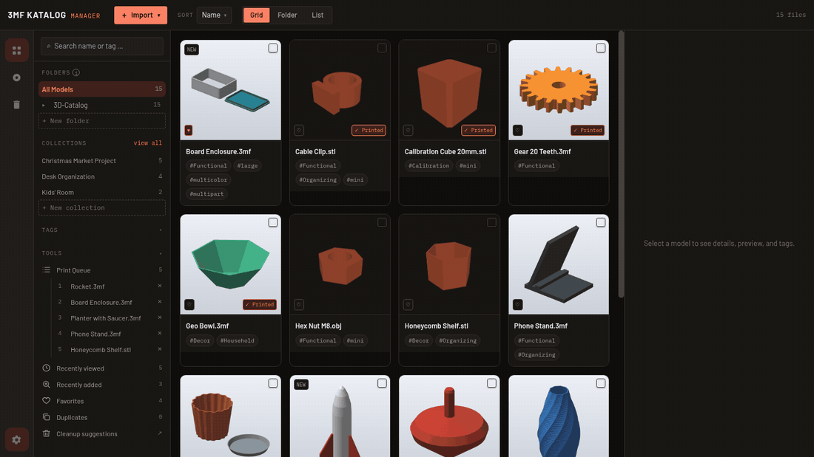
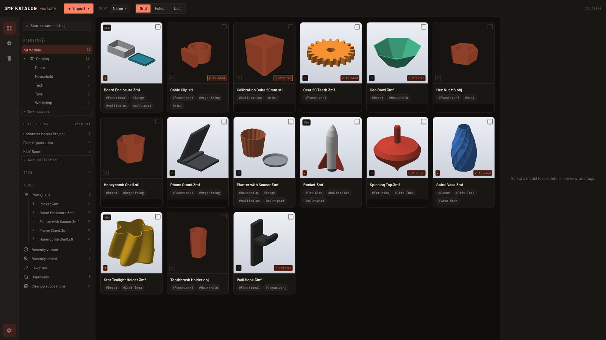
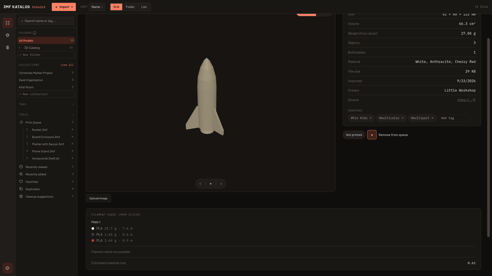
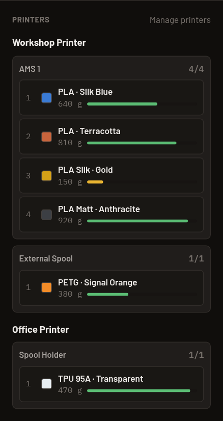
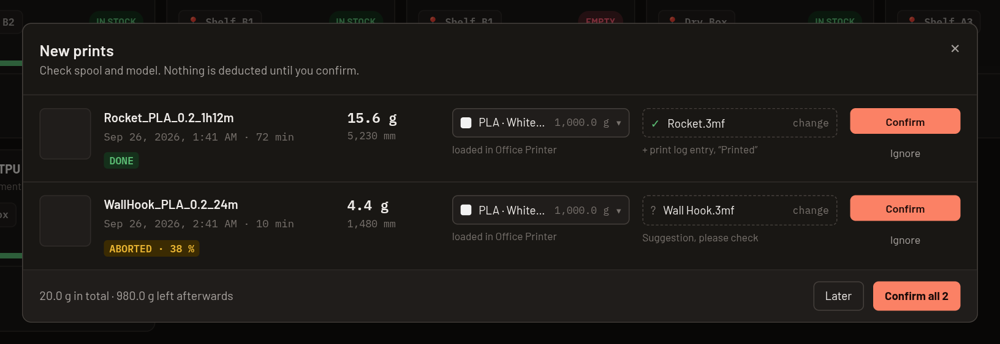

# 3MF Katalog Manager

🇩🇪 **Deutsch:** [README auf Deutsch](README.de.md)

[](https://github.com/Bexxs75/3mf-katalog-manager/releases/latest) [](https://github.com/Bexxs75/3mf-katalog-manager/actions/workflows/ci-checks.yml) [](https://github.com/Bexxs75/3mf-katalog-manager/releases) [](#download) [](LICENSE) [](https://discord.gg/abfVNfFqu3)

**Your 3MF, STL and STEP collection keeps growing? The 3MF Katalog Manager catalogs the folders you already have, finds any model in seconds, shows it in 3D and connects your files with filament, print queue and print history. Everything stays on your computer: no account, no cloud.**



- **100 % local** — no sign-up, no cloud, no tracking. Your files stay where they are.
- **Your existing folders, searchable** — import folders, get automatic tags, real 3D previews and slicer data (weight, filament per plate).
- **More than a file browser** — filament and resin storage with AMS slots, print queue, print log and an optional connection to Klipper printers.

Free and open source (MIT) · Windows, macOS, Linux · English, German, Spanish, French · [Website](https://3mfkatalog.de/en/) · [User guide](docs/benutzerhandbuch/BENUTZERHANDBUCH.md)

## Download

[](https://3mfkatalog.de/en/#download) [](https://3mfkatalog.de/en/#download) [](https://3mfkatalog.de/en/#download)

The buttons open the download section of the website, which always offers the newest version. All files and checksums: [latest release](https://github.com/Bexxs75/3mf-katalog-manager/releases/latest).

**Which file do I need?** Windows: the `.msi`. macOS: the `.dmg` (works on Intel and Apple Silicon). Linux: the `.AppImage`. Files **with** `-step` in the name also show a 3D preview for STEP files (`.stp`/`.step`) and are larger; if you only use 3MF, STL or OBJ, take the file **without** `-step`. Both variants are otherwise identical.

## Compatibility

| Area | Status |
|---|---|
| Windows (`.msi`) | available, unsigned |
| macOS, Intel and Apple Silicon (`.dmg`) | available, unsigned |
| Linux (`.AppImage`) | available; `.deb`, `.rpm` and AUR planned |
| 3MF, STL, OBJ | catalog and 3D preview |
| STEP (`.stp`/`.step`) | catalog; 3D preview with the `-step` download |
| OrcaSlicer / Bambu Studio 3MF | filament usage and weight per plate supported |
| Open in slicer | Bambu Studio, OrcaSlicer, PrusaSlicer, SuperSlicer, UltiMaker Cura detected automatically, others can be added |
| Klipper / Moonraker | available; [more printer models wanted](https://3mfkatalog.de/en/printer-test.html) |
| OctoPrint | planned |
| Bambu Lab (LAN) | planned, depends on a test on real printers |
| PrusaLink | planned later |
| Languages | English, German, Spanish, French |

### Tested printers

| Printer | System | Checked | Result |
|---|---|---|---|
| Sovol SV08 | Stock Klipper | Print list and usage, deducting from the spool in the app | ✅ Confirmed in daily use |
| Anycubic Kobra S1 with ACE Pro | Rinkhals | Print list and usage readable, matching file names to the model | ☑️ Test report checked |
| Qidi Smart 3 | Stock Klipper | Print list and usage readable; the printer's clock was wrong | 🟡 From v0.15.0 |

*Confirmed in daily use*: tried with the app on a real printer. *Test report checked*: the data from the anonymous [test form](https://3mfkatalog.de/en/printer-test.html) fits, a hands-on test is still missing. Your printer is missing? Your test adds it.

## Is it safe to install?

Windows and macOS show a warning on the first start because the packages are **not code-signed**: the certificates for that cost money every year, which a free hobby project can't cover yet. The warning says "unknown publisher", not that anything harmful was found.

What you can check yourself:

- **Open source:** every release is built from the public source code by [GitHub Actions workflows](https://github.com/Bexxs75/3mf-katalog-manager/tree/master/.github/workflows). The source of each version is the matching tag, e.g. [v0.14.0](https://github.com/Bexxs75/3mf-katalog-manager/tree/v0.14.0).
- **Checksums:** every release contains `SHA256SUMS.txt`. Compare it with the hash of your download:
  - Windows (PowerShell): `Get-FileHash .\3MF.Katalog.Manager_…msi -Algorithm SHA256`
  - macOS: `shasum -a 256 3MF.Katalog.Manager_…dmg`
  - Linux: `sha256sum -c SHA256SUMS.txt --ignore-missing`
- **Starting anyway:** Windows SmartScreen: "More info" → "Run anyway". macOS: right-click the app → "Open"; on macOS 15 or newer: System Settings → Privacy & Security → "Open Anyway".
- **Local only:** the app works offline. It only goes online to check GitHub for a newer version and, if you switch it on, to talk to printers on your home network.

## What it does

- **Find and organize models** — import files or whole folders, automatic tags, search, folders, collections, favorites, duplicates detection, trash.
- **Understand files and metadata** — 3D preview for 3MF, STL, OBJ (and STEP), dimensions, volume, build plates, filament usage and weight from OrcaSlicer/Bambu Studio.
- **Manage filament and resin** — spools and resin bottles with stock, location and price, printers with AMS/MMU slots, "Is there enough filament?" per model.
- **Plan and document prints** — print queue, print status, print log with photos, estimated material cost, open in your slicer with one click.
- **Connect printers** — optional, read-only: Klipper/Moonraker printers report the filament used, you confirm and it is deducted. OctoPrint and Bambu Lab are planned.
- **Safe and local** — catalog backup as ZIP, archives extracted safely, Content Security Policy, no cloud.

<details>
<summary><b>All features in detail</b></summary>

- **3MF, STL, OBJ, and STEP parsing** — 3MF (OPC container extraction incl. embedded thumbnail), ASCII/binary STL, and OBJ each have a 3D preview; STEP files (`.stp`/`.step`) are read through Open CASCADE and provide a 3D preview, dimensions, volume, and body count. Every platform (Linux/Windows/macOS) ships two downloads: one **with** STEP preview and one smaller one **without** (cataloging only, no 3D preview for STEP) — see [Downloads](#downloads).
- **Automatic metadata extraction** — dimensions, volume, object count, material (if present in the 3MF)
- **Automatic hashtag generation** — suggestions from filename, geometry features, and slicer profile data, editable by the user
- **Live 3D preview** — three.js rendering directly from the mesh geometry when no embedded thumbnail is available
- **Tag and folder management**, search and filtering
- **Import** of individual files or entire folders (including subfolders) via dialog or drag & drop, through a shared dropdown menu in the header
- **Comfort view** — alternative, significantly more readable interface (larger text, graphics, and controls) alongside the existing compact view, toggleable in the settings panel; favorite marking per model in both views
- **Open in slicer** — launch any number of self-configured slicer programs (vendor-agnostic) directly from the catalog
- **Multilingual UI** — German, English, Spanish, French, switchable at runtime
- **Light/dark theme** with system detection and manual selection, persisted locally
- **Filament inventory** — standalone management of your filament spools (material, manufacturer, color, storage location, diameter, original/remaining weight, price) with autocomplete for material/manufacturer/location, independent of the model catalog; toggleable between a card dashboard (stock bar, status color) and a sortable inventory list, including a stats bar and status filters; when adding new spools, several identical ones can be created at once (each with its own independently tracked remaining stock); "＋ Restock" on the card or "＋" in the list row adds 1 to 20 new, full spools with the same details; double-clicking a card or row opens the edit form; remaining weights to 0.1 g; spool image by click or drag & drop (PNG, JPG or WebP up to 5 MB); spools without an image show a spool icon in their color in the list
- **Resin in the stock** — the "Filament | Resin" switch at the top of the filament inventory changes to your resin bottles: amounts in ml, separate stats ("Total bottles"), suggestions for resin material and manufacturer, "− Use" to deduct the milliliters you used, and restocking just like spools; new entries get the type of the selected area. Resin never goes into a filament slot, only into the resin vat of a resin printer, and is left out of "Is there enough filament?" and the material cost estimate.
- **Printers & AMS slots** — add printers and their multi-material units (Bambu AMS, AMS lite, AMS HT, Creality CFS, Prusa MMU3, Anycubic ACE Pro, spool holder, or custom with any slot count) and put spools into slots by drag & drop or click. Every new printer automatically gets a spool holder, so printers without an AMS can take a spool right away. Loaded spools are shown separately from storage in their own column; when unloaded they automatically return to their home location. Spools have a real color value (palette or hex) in addition to the color name.
- **Resin printers** — when adding a printer you choose "Filament" or "Resin". A resin printer gets a fixed resin vat for one bottle instead of the spool holder; you insert the bottle by dragging or via the vat's menu, see its color and remaining ml, and deduct usage with "− Use".
- **Is there enough filament?** — for sliced 3MF files, the detail page compares the filament requirement with your spools (material and similar color) and shows whether it is enough, enough only with a spool change, or how much is missing – including the matching spool and whether it is loaded in a printer. The print queue shows the status per entry and takes the combined requirement into account.
- **Tools** — a sidebar section with the print queue, "Recently viewed", "Recently added", "Favorites" (all models marked with a heart), "Duplicates" and cleanup suggestions, each with a count; the views filter the catalog and combine with folders, tags and search.
- **Printer connection** — optional (off by default): Klipper/Moonraker printers on your home network report the filament used by finished and aborted prints; after you confirm, it is deducted from the spool, optionally with a print log entry. Read-only, only addresses you entered yourself on your home network. See [Tested printers](#tested-printers); results for more printers are collected on the [test page](https://3mfkatalog.de/en/printer-test.html).
- **Catalog extensions** — print-status toggle + weight per model (real value from the slicer if the 3mf has already been sliced, otherwise a rough estimate from volume × material density), sorting by "last viewed", NEW badge for recently imported models, creators filter (from the 3MF designer metadata), automatic detection of exact file duplicates on import via content hash
- **Filament usage from the slicer** — reads the filament usage sliced in OrcaSlicer/Bambu Studio (`Metadata/slice_info.config`): real weight instead of an estimate, breakdown per build plate and filament (type, color, grams, meters) on the model detail page; "Rescan metadata" button retrieves the values afterward if an already-catalogued file was re-sliced in OrcaSlicer/Bambu Studio
- **Material cost estimate** — for models with real slicer filament usage, an additional estimated material cost on the detail page, computed from consumption and the prices of matching spools in the filament inventory
- **Print log** — in addition to the print-status toggle, a log of multiple print attempts per model (date, note, photo), independent of print status
- **Catalog backup** — export and re-import the entire catalog (database + settings) as a ZIP, with automatic backup of the existing database before every import
- **Extract archives directly** — archives you import or drag in individually (`.zip`, `.7z`, `.rar`, `.tar`, `.tar.gz`/`.tgz`, `.tar.bz2`, `.tar.xz`, `.tar.zst`) are extracted into a subfolder after a confirmation dialog, and the models inside are cataloged. You choose the target folder, what happens when the folder already exists, and whether the original archive is deleted; nothing is ever overwritten. For security reasons, programs, scripts, and shortcuts inside archives are never extracted. Password-protected and multi-part archives are detected but not extracted.
- **Model thumbnails** — grid view shows a real image per model (own upload, embedded 3MF thumbnail, or a snapshot automatically generated from the live 3D preview), plus an optional source link per model
- **Queue** — ordered, drag-and-drop sortable list ("print next") in its own sidebar section, automatically removed when marked as printed
- **Cleanup suggestions** — manually triggered catalog scan finds orphaned file paths and stock duplicates, cleanup via a selection dialog
- **Model detail page** — full-screen view (double-click a model) with a large 3D preview, all metadata, and build-plate count for Bambu Studio/OrcaSlicer files; dedicated rotation controls (auto-rotation + 15° step buttons) in addition to free mouse dragging
- **Trash** — deleted models remain recoverable for 7 days instead of being removed immediately, own view with a count badge
- **Multi-select** — checkboxes in the catalog overview, "select all", action bar for queue/collection/print-status/tags/delete across multiple models at once
- **Keyboard shortcuts** — `/` focuses search, arrow keys navigate the grid spatially (Up/Down jumps to the next row), Space toggles the multi-select checkbox, Delete/Backspace opens the delete confirmation when a multi-selection is active
- **Rename** — rename models directly from the context menu; the file extension stays fixed
- **Automatic slicer detection** — scans known installation locations at startup (Bambu Studio, OrcaSlicer, PrusaSlicer, SuperSlicer, UltiMaker Cura on Linux/Windows) and adds matches automatically; manual addition for custom forks remains possible
- **Preferred view** — setting for whether the catalog and detail page default to the embedded file image or a rendered 3D view; missing snapshots are automatically re-rendered in the background as needed
- **Collections** — a third organizational mechanism alongside folders and tags: explicitly group multiple models into a project, with a manually definable order (drag & drop); created via multi-select
- **Custom app icon** — isometric 3D-printing layer cube in the app's real accent colors
- **Content Security Policy** active (no `csp: null`), source URL fields and "open in slicer" validated server-side

</details>

## Screenshots

| Catalog with previews | Model with slicer data |
|---|---|
|  |  |
| **Printers and AMS slots** | **Confirming prints from a Klipper printer** |
|  |  |

## Help and documentation

- [User guide](docs/benutzerhandbuch/BENUTZERHANDBUCH.md) (DE + EN), step by step with screenshots
- [Website](https://3mfkatalog.de/en/) with FAQ
- [Discord](https://discord.gg/abfVNfFqu3) for questions and ideas
- Bugs: [open an issue](https://github.com/Bexxs75/3mf-katalog-manager/issues/new/choose), ask on Discord, or use the [bug report form](https://3mfkatalog.de/en/report-a-bug.html) (no account needed)

## Contributing

Help is welcome, and not only with code: test your printer on the [test page](https://3mfkatalog.de/en/printer-test.html), check a translation, try the installation on your system or report a bug. See [CONTRIBUTING.md](CONTRIBUTING.md), issues labeled [good first issue](https://github.com/Bexxs75/3mf-katalog-manager/labels/good%20first%20issue) and the [translation guide](docs/TRANSLATING.md).

## Status and roadmap

This project is under active development. The local catalog (import, parsing, tagging, search, 3D preview, multilingual UI, theming) and "open in slicer" are functional. The following is **not** yet implemented:

- **Cloud integration** (Google Drive etc.): existed previously but was removed again — too unstable/error-prone for everyday use. Will be cleanly redesigned at some point, see CHANGELOG
- **"Open in slicer" for manually added slicers on macOS**: opening works reliably for automatically detected slicers (Bambu Studio, OrcaSlicer, PrusaSlicer, SuperSlicer, UltiMaker Cura), since detection already finds the correct, directly executable program file inside the `.app` bundle. For manually added slicers, that same file needs to be selected in the file picker, not the `.app` bundle itself
- **STEP preview as a separate download**: all three platforms ship two package variants for this instead of a single one with STEP preview baked in — see [Downloads](#downloads).
- **Code signing**: the macOS `.dmg` and Windows `.msi` packages are unsigned (no Apple Developer or Windows code-signing certificate) — Gatekeeper/SmartScreen will warn accordingly on first launch

The public [roadmap](https://github.com/users/Bexxs75/projects/1/views/1?groupedBy%5BcolumnId%5D=416999698) shows what comes next.

## Tech Stack

- **Framework:** Tauri 2 (Rust backend, WebView frontend)
- **Frontend:** React 19, TypeScript, Tailwind CSS, Vite
- **3D rendering:** three.js
- **Database:** SQLite (`rusqlite`)

## Development

Prerequisites: Node.js, the Rust toolchain (`cargo`), and the [Tauri system dependencies](https://tauri.app/start/prerequisites/) for your operating system. The default STEP-preview build additionally requires Open CASCADE 7.8 or 7.9 as dynamic system libraries, including development files.

```bash
npm install
npm run tauri dev
```

Without OCCT, or to build a variant without STEP preview:

```bash
npm run tauri dev -- -- --no-default-features
# or: npm run tauri build -- -- --no-default-features
```

Backend tests:

```bash
cd src-tauri
cargo test
```

Production build (type checking + Vite build):

```bash
npm run build
```

## Project Structure

```
src/               React frontend (components, i18n, hooks, types)
src-tauri/         Rust backend (Tauri commands, DB, 3MF/STL/OBJ/STEP parsers, tagging)
docs/              Additional documentation
```

## License

The application code is licensed under MIT — see [LICENSE](LICENSE). The optional STEP preview dynamically links Open CASCADE under LGPL-2.1 with the Open CASCADE exception. See [THIRD-PARTY-LICENSES.md](THIRD-PARTY-LICENSES.md) for details, full license texts, and source information.
