# Benutzerhandbuch — 3MF Katalog Manager

Dieses Handbuch richtet sich an alle, die den 3MF Katalog Manager zum ersten Mal benutzen und
sich mit der App noch nicht auskennen. Es erklärt Schritt für Schritt, wie du Modelle
importierst, organisierst, druckfertig machst und dein Filament-Lager verwaltest.

> **Hinweis zu den Bildern in diesem Handbuch:** Alle Screenshots zeigen die App mit frei
> erfundenen Beispieldaten (fiktive Modelle wie "Kabelhalter Set" oder "Gartenzwerg Mini",
> fiktive Filamentspulen) — keine echten Nutzerdaten. Die tatsächliche Optik entspricht exakt
> dem, was du siehst; nur der Inhalt ist zu Demonstrationszwecken erfunden.

## Inhalt

1. [Was ist der 3MF Katalog Manager?](#was-ist-der-3mf-katalog-manager)
2. [Installation](#installation)
3. [Erste Schritte](#erste-schritte)
4. [Die Oberfläche im Überblick](#die-oberfläche-im-überblick)
5. [Dateien importieren](#dateien-importieren)
6. [Katalog durchsuchen und organisieren](#katalog-durchsuchen-und-organisieren)
7. [Ein Modell im Detail ansehen](#ein-modell-im-detail-ansehen)
8. [Schnelle Aktionen: Kontextmenü und Mehrfachauswahl](#schnelle-aktionen-kontextmenü-und-mehrfachauswahl)
9. [Sammlungen](#sammlungen)
10. [Die Druck-Warteschlange](#die-druck-warteschlange)
11. [Modelle direkt im Slicer öffnen](#modelle-direkt-im-slicer-öffnen)
12. [Das Filament-Lager](#das-filament-lager)
13. [Druckprotokoll](#druckprotokoll)
14. [Der Papierkorb](#der-papierkorb)
15. [Einstellungen](#einstellungen)
16. [Katalog sichern und wiederherstellen (Backup)](#katalog-sichern-und-wiederherstellen-backup)
17. [Bekannte Einschränkungen](#bekannte-einschränkungen)
18. [Häufige Fragen (FAQ)](#häufige-fragen-faq)

---

## Was ist der 3MF Katalog Manager?

Der 3MF Katalog Manager ist ein Desktop-Programm, mit dem du eine große Sammlung von
3D-Druck-Dateien (`.3mf`, `.stl`, `.obj` sowie CAD-Quelldateien im `.stp`-/`.step`-Format) übersichtlich verwalten kannst: mit Vorschaubildern,
Ordnern, Tags, Suche, einem eigenen Lager für deine Filamentspulen und einem direkten Weg, ein
Modell mit einem Klick in deinem Slicer-Programm zu öffnen. Die Linux-Fassung erzeugt über Open
CASCADE auch für STEP-Dateien eine 3D-Vorschau und liest Maße, Volumen und Körperzahl aus. Alles
läuft lokal auf deinem Rechner — es gibt keine Cloud-Anbindung, deine Daten verlassen deinen
Computer nicht.

## Installation

Die App steht für Linux, Windows und macOS zum Download bereit (siehe die
[Releases-Seite](https://github.com/Bexxs75/3mf-katalog-manager/releases) des Projekts).

- **Linux:** `.tar.gz`-Archiv entpacken, die enthaltene `.AppImage`-Datei ausführbar machen und
  starten.
- **Windows:** `.msi`-Installer ausführen. Das Paket ist unsigniert (kein
  Windows-Code-Signing-Zertifikat) — SmartScreen warnt beim ersten Start. Über "Weitere
  Informationen" → "Trotzdem ausführen" fortfahren.
- **macOS:** `.dmg`-Datei öffnen und die App in den Programme-Ordner ziehen. Auch hier ist das
  Paket unsigniert (kein Apple-Developer-Zertifikat) — Gatekeeper blockiert den ersten Start.
  Mit Rechtsklick auf die App → "Öffnen" und im Dialog bestätigen lässt sie sich trotzdem
  starten.

## Erste Schritte

Beim allerersten Start fragt dich die App, wie dein Katalog organisiert sein soll:

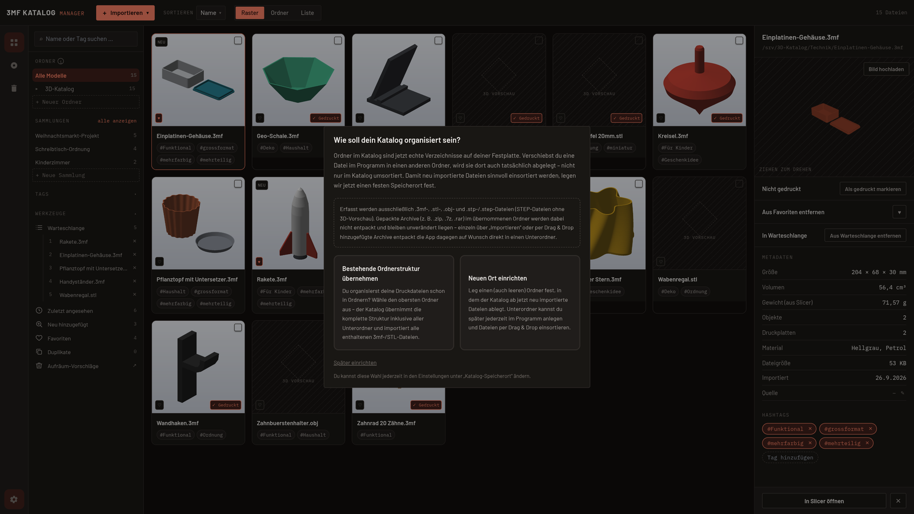

Seit dieser App-Version entsprechen die Ordner im Katalog echten Verzeichnissen auf deiner
Festplatte — verschiebst du eine Datei im Programm in einen anderen Ordner, wird sie dort auch
tatsächlich abgelegt, nicht nur im Katalog umsortiert. Du hast zwei Möglichkeiten:

- **Bestehende Ordnerstruktur übernehmen** — wenn du deine Druckdateien schon in Ordnern
  organisierst, wählst du den obersten Ordner aus. Der Katalog übernimmt die komplette Struktur
  inklusive Unterordner und importiert alle enthaltenen `.3mf`-/`.stl`-/`.obj`-/`.stp`-/`.step`-Dateien automatisch.
- **Neuen Ort einrichten** — du legst einen (auch leeren) Ordner fest, in dem der Katalog ab
  jetzt neu importierte Dateien ablegt.

Du kannst diese Wahl jederzeit in den Einstellungen unter "Katalog-Speicherort" ändern. Über
"Später einrichten" lässt sich der Dialog auch überspringen.

Bereits gepackte Archive (z. B. `.zip`) werden beim automatischen Einlesen nicht berücksichtigt
und bleiben unverändert liegen — entpacke sie bei Bedarf vorher, oder öffne den Ordner nach der
Einrichtung direkt über den Katalog im Dateimanager.

## Die Oberfläche im Überblick

- **Ganz links, die schmale Navigationsleiste:** wechselt zwischen Katalog, Filament-Lager und
  Papierkorb (mit Mengen-Badge). Ganz unten befindet sich das Zahnrad-Symbol für die
  Einstellungen.
- **Seitenleiste (Sidebar):** Suchfeld, darunter dein Ordnerbaum mit Anzahl der Modelle pro
  Ordner, deine Sammlungen, deine Tags und deine Druck-Warteschlange.
- **Hauptbereich:** dein Katalog als Raster (Kacheln mit Vorschaubild) oder als Liste
  umschaltbar, dazu Sortierung und der "Importieren"-Button oben links.
- **Detailpanel rechts:** zeigt Vorschau und Metadaten des gerade ausgewählten Modells, inklusive
  Schnellaktionen wie "Gedruckt"/"Zur Warteschlange hinzufügen".

## Dateien importieren

Über den roten "+ Importieren"-Button oben links stehen mehrere Wege offen: einzelne Dateien per
Dialog auswählen, einen ganzen Ordner (inklusive Unterordner) importieren, oder Dateien direkt per
Drag & Drop aus deinem Dateimanager in das Katalog-Fenster ziehen. Beim Import werden Abmessungen,
Volumen, Objektanzahl und (falls in der Datei vorhanden) Materialangaben automatisch ausgelesen,
und die App schlägt passende Hashtags vor, die du danach frei bearbeiten kannst.

Importiert die App eine Datei, die inhaltlich bereits im Katalog vorhanden ist (exakter
Duplikat-Abgleich per Inhalts-Hash), wird das erkannt, statt sie ein zweites Mal anzulegen.

## Katalog durchsuchen und organisieren

Oben rechts neben "Importieren" wechselst du zwischen drei Ansichten: **Raster** (Bildkacheln,
siehe Screenshot oben), **Ordner** und **Liste**:

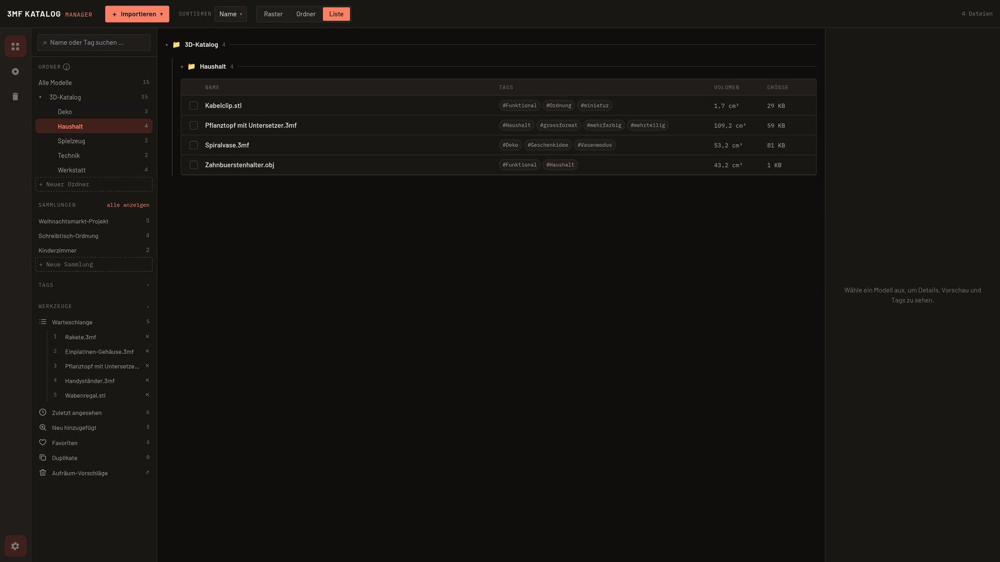

Die Liste zeigt zusätzliche Spalten (Tags, Volumen, Dateigröße) und lässt sich per Klick auf die
Spaltenüberschrift sortieren.

### Ordner-Ansicht

Die Ansicht **Ordner** gruppiert deine Modelle nach der echten Ordnerstruktur auf der Festplatte —
wie in einem Datei-Explorer, mit Unterordnern eingerückt und einer durchgehenden Verbindungslinie:

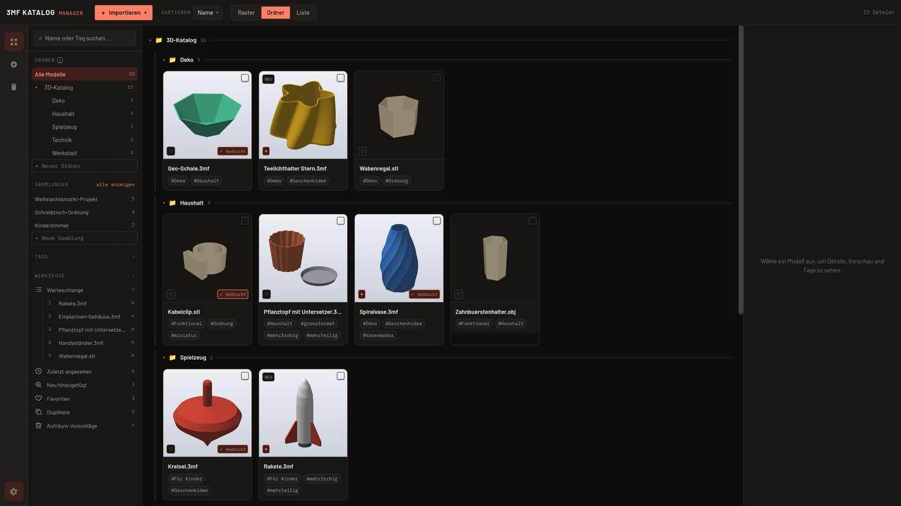

Jede Ordner-Kopfzeile zeigt die Gesamtzahl der enthaltenen Dateien, inklusive aller Unterordner.
Per Klick auf die Kopfzeile klappst du einen Ordner ein oder aus — der Zustand bleibt über einen
Neustart der App erhalten. Dateien ohne Ordner erscheinen als letzte Sektion "Ohne Ordner". Sowohl
Ordner-Kopfzeilen als auch einzelne Dateien lassen sich innerhalb dieser Ansicht direkt per Maus
verschieben, genau wie in der Seitenleiste — das Verschieben wirkt sich sofort auch auf der
Festplatte aus.

Dieselbe Gruppierung funktioniert auch in der Listen-Darstellung:

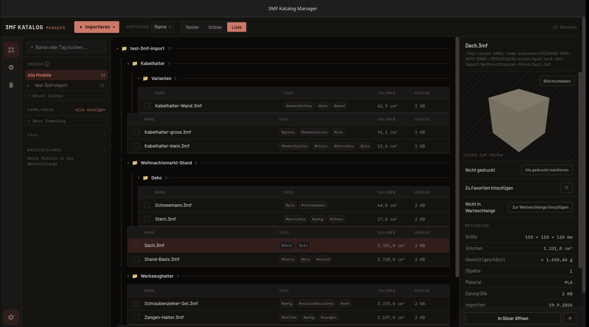

Zum Organisieren stehen dir insgesamt drei unabhängige Mechanismen zur Verfügung, die du beliebig
kombinieren kannst:

- **Ordner** (Sidebar links) — echte Verzeichnisse auf der Festplatte, siehe oben.
- **Tags** — frei vergebene Hashtags, in der Sidebar unter "Tags" gesammelt, anklickbar zum
  Filtern.
- **Sammlungen** — mehrere Modelle explizit zu einem Projekt zusammenfassen (siehe unten,
  [Sammlungen](#sammlungen)).

Über das Suchfeld oben in der Sidebar filterst du nach Name, Tag, Ersteller oder Dateipfad — ein
Treffer in irgendeinem dieser Felder reicht. Mit der Taste `/` springst du von überall aus direkt
ins Suchfeld, ohne erst mit der Maus dorthin zu klicken. Häufig genutzte Kombinationen aus
Ordner/Tag/Ersteller/Suche/Sortierung lassen sich unter einem eigenen Namen speichern und später
per Klick wieder anwenden ("Gespeicherte Filter").

**Tastaturkürzel:** `/` fokussiert die Suche, die Pfeiltasten navigieren räumlich im Raster (Hoch/
Runter springt anhand der tatsächlich sichtbaren Kachel-Position zur nächsten Zeile, Links/Rechts
zum nächsten/vorherigen Modell), die Leertaste schaltet die Mehrfachauswahl-Checkbox des gerade
ausgewählten Modells um, und Entf/Rücktaste öffnet bei aktiver Mehrfachauswahl die
Löschen-Bestätigung (siehe [Mehrfachauswahl](#schnelle-aktionen-kontextmenü-und-mehrfachauswahl)).
Keines davon greift, solange du gerade in einem Textfeld tippst.

## Ein Modell im Detail ansehen

Ein Doppelklick auf ein Modell öffnet die volle Detailseite:

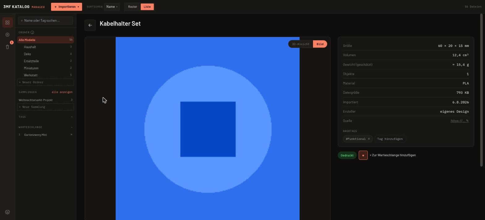

Oben rechts im Vorschaubereich schaltest du zwischen **3D-Ansicht** (freies Drehen per
Maus-Ziehen, plus Auto-Rotation und 15°-Schritt-Buttons) und dem hinterlegten **Bild** um — welche
der beiden standardmäßig angezeigt wird, legst du in den Einstellungen unter "Bevorzugte Ansicht"
fest. Rechts siehst du alle Metadaten (Maße, Volumen, geschätztes Gewicht, Material, Dateigröße,
Importdatum, Ersteller), darunter ein Feld für eine **Quelle** (z. B. ein Link zur
Modell-Herkunftsseite) sowie deine Hashtags mit Möglichkeit, weitere hinzuzufügen oder zu
entfernen. Wurde die Datei bereits in OrcaSlicer oder Bambu Studio gesliced, liest die App das
reale Filamentgewicht direkt aus den Slicer-Metadaten statt es nur grob zu schätzen — inklusive
Aufschlüsselung pro Druckplatte und Filament sowie einer geschätzten Materialkosten-Summe, wenn
passende Spulen im Filament-Lager hinterlegt sind. Über den "Metadaten neu einlesen"-Knopf holst du
diese Werte nachträglich nach, falls du eine bereits katalogisierte Datei erst später im Slicer
nachgesliced hast.

Unten links kannst du das Modell als **gedruckt** markieren und es zur **Warteschlange**
hinzufügen.

## Schnelle Aktionen: Kontextmenü und Mehrfachauswahl

Rechtsklick auf ein Modell öffnet ein Kontextmenü mit den wichtigsten Aktionen:

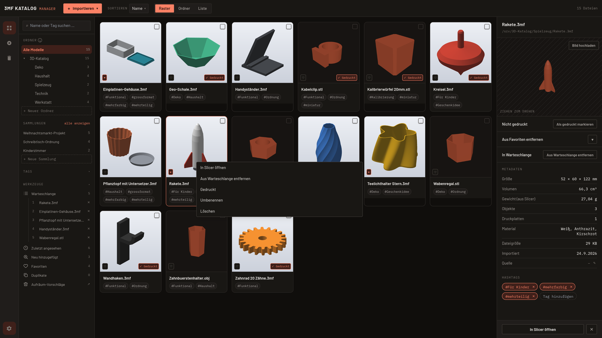

Über "Umbenennen" änderst du den Dateinamen direkt im Kontextmenü — die Dateiendung wird dabei
fest angezeigt und lässt sich nicht mit wegtippen. Verschiebt der neue Name das Modell
in der Standardsortierung (nach Name) aus dem sichtbaren Bereich, scrollt die Ansicht automatisch
dorthin.

Willst du mehrere Modelle gleichzeitig bearbeiten, markierst du sie über die Checkboxen oben
links auf jeder Kachel (oder "Alle auswählen"). Eine Aktionsleiste erscheint, über die sich die
Auswahl gemeinsam zur Warteschlange oder einer Sammlung hinzufügen, mit einem Tag versehen oder
davon befreien ("Tag hinzufügen" / "Tag entfernen" — Letzteres zeigt ein Dropdown mit allen in
der Auswahl vorkommenden Tags), als gedruckt/nicht gedruckt markieren oder löschen lässt. Bei
aktiver Mehrfachauswahl öffnet auch die Taste Entf/Rücktaste direkt die Löschen-Bestätigung:

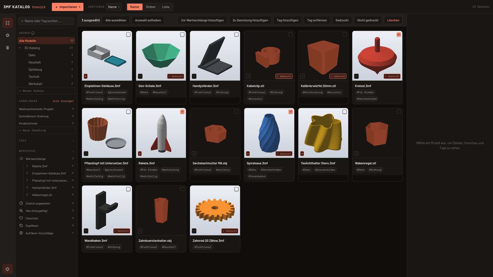

## Sammlungen

Sammlungen sind ein dritter Organisationsmechanismus neben Ordnern und Tags: Du fasst mehrere
Modelle explizit zu einem Projekt zusammen, mit einer manuell festlegbaren Reihenfolge (Drag &
Drop). Eine neue Sammlung legst du über "+ Neue Sammlung" in der Sidebar an und befüllst sie über
die Mehrfachauswahl. Ein Klick auf eine Sammlung in der Sidebar filtert den Katalog auf ihre
Modelle:

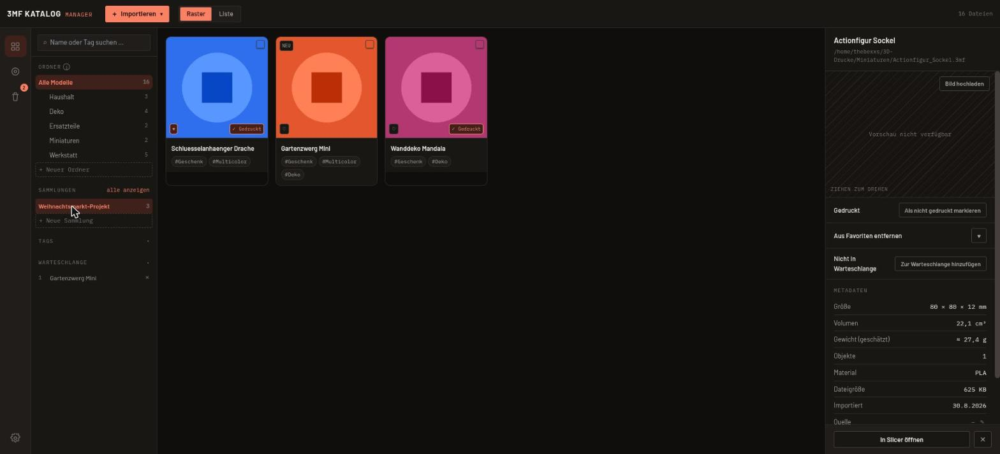

## Die Druck-Warteschlange

Unter "Warteschlange" in der Sidebar sammelst du Modelle, die als Nächstes gedruckt werden
sollen — per Drag & Drop sortierbar. Markierst du ein Modell als gedruckt, wird es automatisch
wieder aus der Warteschlange entfernt.

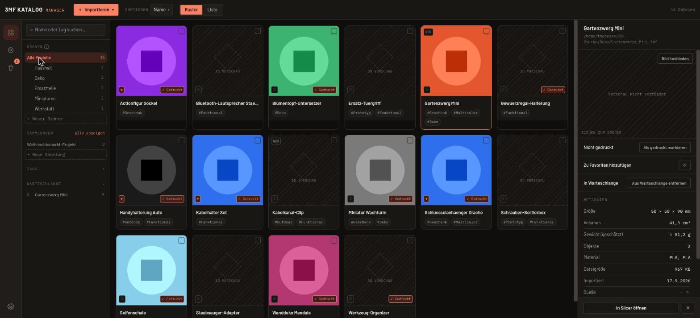

## Modelle direkt im Slicer öffnen

Über "In Slicer öffnen" (im Detailpanel, auf der Detailseite oder im Kontextmenü) startet die App
direkt dein Slicer-Programm mit der ausgewählten Datei. Welche Slicer zur Auswahl stehen und
welcher davon dein **Standard-Slicer** ist, richtest du in den Einstellungen ein (siehe unten).

> Unter macOS funktioniert diese Funktion derzeit nicht zuverlässig — siehe
> [Bekannte Einschränkungen](#bekannte-einschränkungen).

## Das Filament-Lager

Das Filament-Lager ist eine eigenständige Verwaltung für deine Filamentspulen, unabhängig vom
Modell-Katalog. Du erreichst es über das zweite Symbol in der Navigationsleiste ganz links.

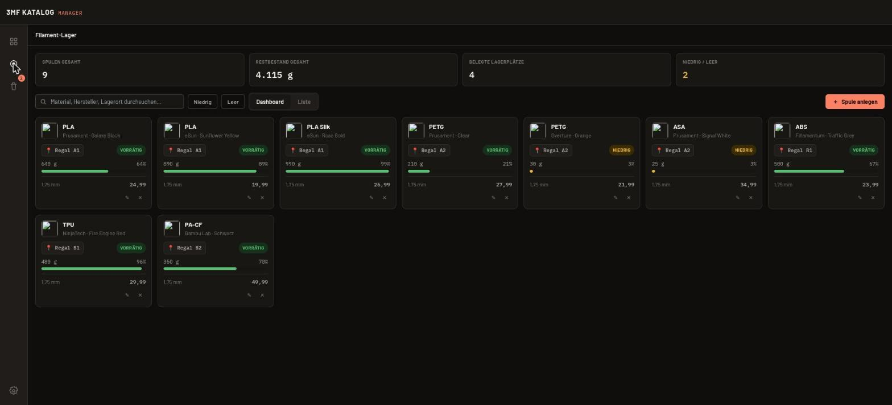

Oben siehst du eine Statistik-Leiste (Spulen gesamt, Restbestand gesamt, belegte Lagerplätze,
Spulen mit niedrigem/leerem Bestand). Jede Spulen-Karte zeigt Material, Hersteller, Farbe,
Lagerort, verbleibendes Gewicht als Balken und Prozentwert sowie einen Status: **Vorrätig**
(grün), **Niedrig** (orange, wenn der Bestand knapp wird) oder **Leer**. Über die
Filterknöpfe "Niedrig"/"Leer" oder das Suchfeld findest du gezielt Spulen, die bald nachbestellt
werden müssen.

Alternativ zur Kachel-Ansicht gibt es eine sortierbare Listenansicht ("Liste" neben "Dashboard"):

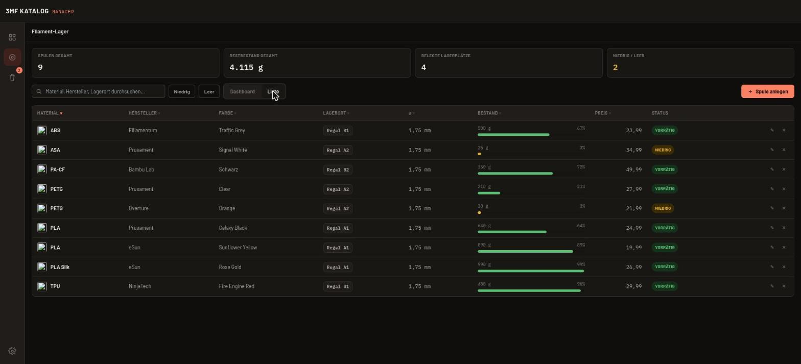

Über "+ Spule anlegen" öffnest du das Formular für eine neue Spule:

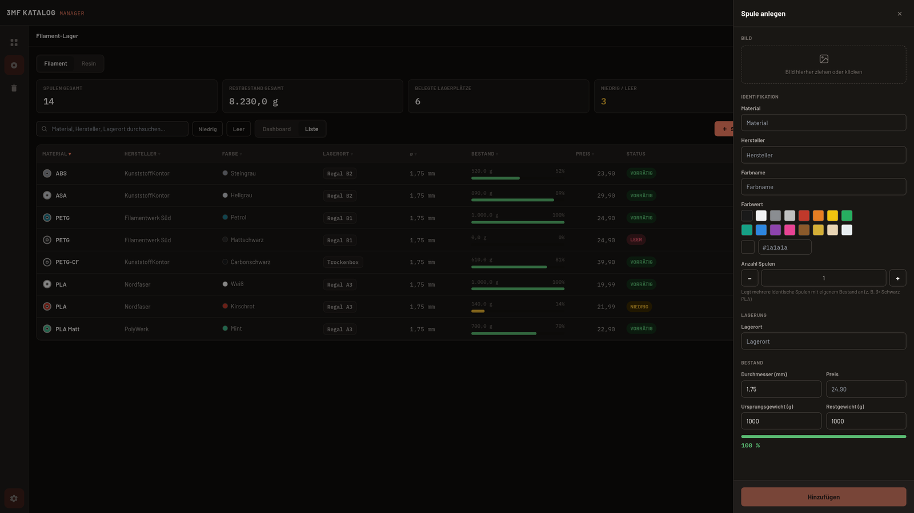

Neben den üblichen Angaben (Material, Hersteller, Farbe, Lagerort, Durchmesser, Preis,
Ursprungs-/Restgewicht, optional ein Foto) lässt sich hier auch die **Anzahl** angeben: Legst du
z. B. drei identische PLA-Spulen gleichzeitig an, erhält jede davon trotzdem ihren eigenen,
unabhängig verfolgten Restbestand. Für Material, Hersteller und Lagerort schlägt die App beim
Tippen bereits verwendete Werte vor (Autocomplete).

## Druckprotokoll

Zusätzlich zum einfachen Gedruckt/Nicht-gedruckt-Status kannst du zu jedem Modell ein Protokoll
mehrerer Druckversuche führen (Datum, eine Notiz, optional ein Foto) — nützlich, wenn du
dasselbe Modell mehrfach druckst und den Überblick behalten willst, welcher Versuch wann
funktioniert hat.

## Der Papierkorb

Gelöschte Modelle werden nicht sofort entfernt, sondern wandern für 7 Tage in den Papierkorb und
lassen sich in dieser Zeit wiederherstellen:

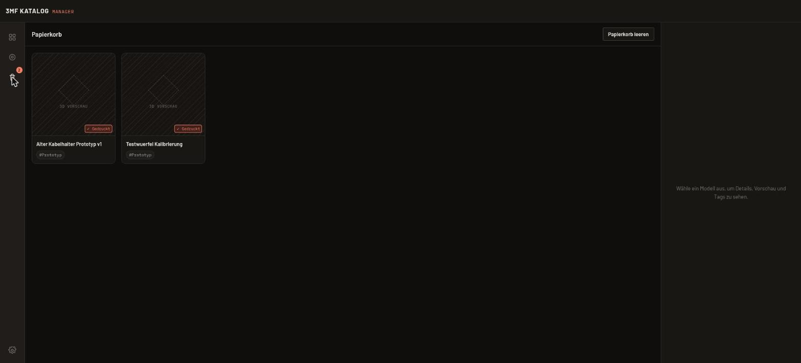

Über "Papierkorb leeren" oben rechts entfernst du alle enthaltenen Modelle sofort und endgültig.

## Einstellungen

Über das Zahnrad-Symbol unten in der Navigationsleiste öffnest du die Einstellungen. Sie sind in
vier Reiter aufgeteilt: **Allgemein**, **Slicer**, **Katalog** und **Info**.

### Allgemein

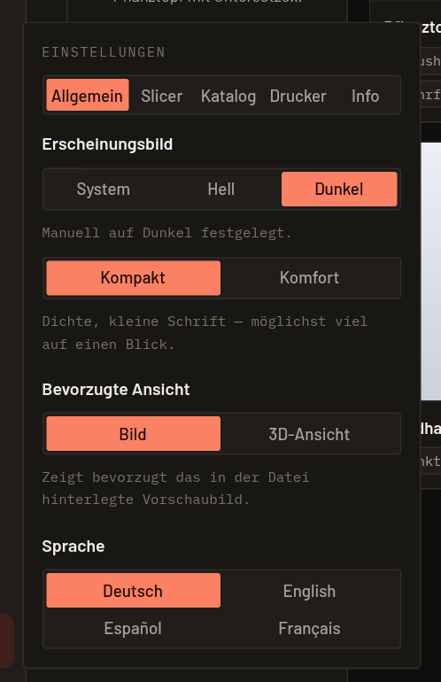

- **Erscheinungsbild** — folgt automatisch deiner Systemeinstellung, oder fest auf Hell/Dunkel
  gestellt. Direkt darunter die Dichte-Einstellung: "Kompakt" (dicht, kleine Schrift, viel auf
  einen Blick) oder "Komfort" (größere Schrift, Grafiken und Bedienelemente, deutlich lesbarer).
- **Bevorzugte Ansicht** — ob Katalog und Detailseite standardmäßig das hinterlegte Vorschaubild
  oder die gerenderte 3D-Ansicht zeigen. Fehlende Schnappschüsse werden bei Bedarf automatisch im
  Hintergrund nachgerendert.
- **Sprache** — Deutsch, Englisch, Spanisch oder Französisch, sofort wirksam ohne Neustart.

### Slicer

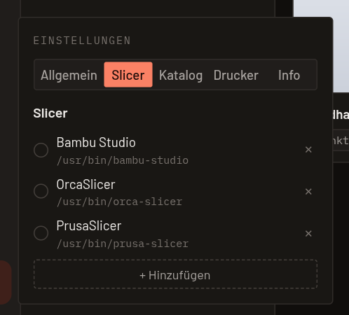

Die App durchsucht beim Start bekannte Installationsorte (Bambu Studio, OrcaSlicer, PrusaSlicer,
SuperSlicer, UltiMaker Cura) und trägt gefundene Slicer automatisch ein; über "+ Hinzufügen"
ergänzt du weitere, auch selbst kompilierte oder abgewandelte Versionen. Der Radiobutton legt
fest, welcher Slicer beim Öffnen eines Modells als **Standard** verwendet wird.

### Katalog

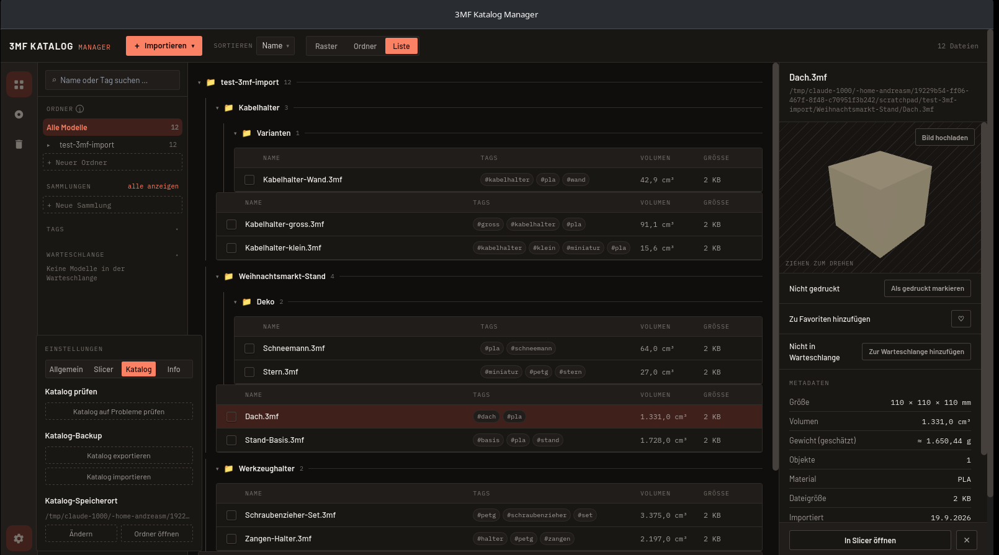

- **Katalog prüfen** — ein manuell auslösbarer Scan findet verwaiste Dateipfade (Datei im Katalog
  eingetragen, aber auf der Festplatte nicht mehr vorhanden) und Bestands-Duplikate, mit
  Bereinigung per Auswahl-Dialog.
- **Katalog-Backup** — siehe nächster Abschnitt.
- **Katalog-Speicherort** — zeigt den aktuellen Basisordner und erlaubt, ihn zu ändern oder direkt
  im Dateimanager zu öffnen.

### Info

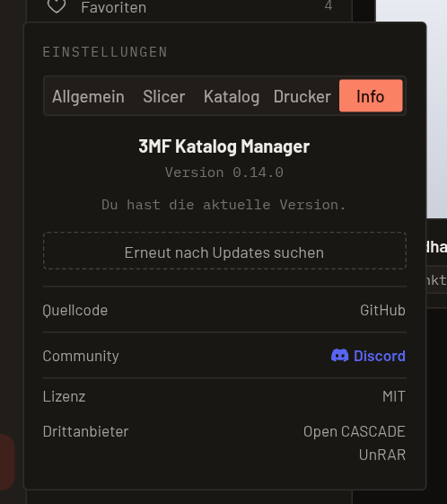

Zeigt die installierte Version sowie Links zu Quellcode, Anwendungslizenz und den Lizenzen der
Drittanbieter-Komponenten. Beim Start der App wird
einmalig im Hintergrund still geprüft, ob auf GitHub eine neuere Version vorliegt — es wird
**nichts automatisch heruntergeladen**. Ist eine neuere Version verfügbar, erscheint unten rechts
ein wegklickbarer Hinweis mit einem "Herunterladen"-Knopf, der die passende Release-Seite im
Standardbrowser öffnet. Denselben Status siehst du jederzeit auch hier im Info-Tab, inklusive
einem Knopf "Erneut nach Updates suchen" für eine manuelle Prüfung.

Unten im Screenshot siehst du ein Beispiel für das **Hell**- bzw. **Dunkel**-Theme im direkten
Vergleich:

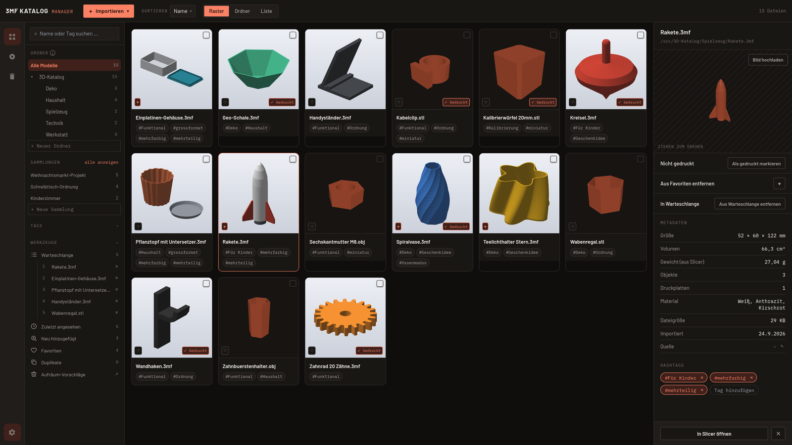
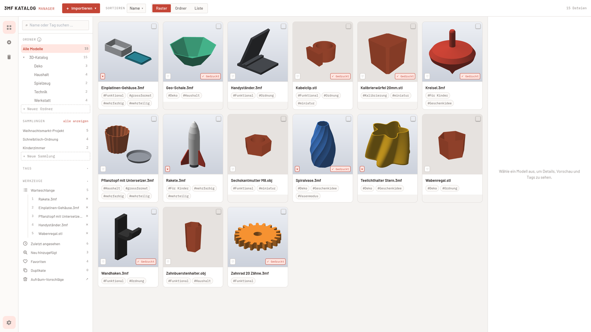

## Katalog sichern und wiederherstellen (Backup)

Über "Katalog-Backup" in den Einstellungen exportierst du deinen kompletten Katalog (Datenbank
und Einstellungen) als ZIP-Datei — praktisch vor einem Systemwechsel oder einfach als
Sicherheitskopie. Beim Wiedereinspielen einer solchen Sicherung legt die App automatisch vorher
eine Sicherung deiner bestehenden Datenbank an, sodass ein versehentlicher Import nichts
unwiderruflich überschreibt.

## Bekannte Einschränkungen

- Die **3D-Vorschau und automatisch ermittelten CAD-Metadaten für STEP-Dateien** sind zunächst nur
  in der Linux-Fassung enthalten. Die offiziellen Windows- und macOS-Pakete katalogisieren
  `.stp`/`.step` weiterhin, zeigen diese Dateien aber ohne 3D-Vorschau an.
- **"In Slicer öffnen" unter macOS** funktioniert derzeit nicht zuverlässig, da Slicer dort meist
  als `.app`-Bundle installiert sind (eigener Start-Mechanismus statt einer direkt ausführbaren
  Datei). Auf Linux und Windows ist die Funktion uneingeschränkt nutzbar.
- Die macOS- und Windows-Installationspakete sind **unsigniert** — Gatekeeper bzw. SmartScreen
  warnen beim ersten Start (siehe [Installation](#installation) für den Weg drumherum).
- Es gibt **keine Cloud-Anbindung** — der Katalog ist bewusst rein lokal, eine frühere
  Google-Drive-Anbindung wurde wieder entfernt, weil sie im Alltag zu instabil war.

## Häufige Fragen (FAQ)

**Warum sehe ich bei manchen Modellen nur ein gepunktetes Muster statt eines Vorschaubilds?**
Das Modell hat weder ein eigenes hochgeladenes Bild, noch ein in der Datei eingebettetes
Thumbnail, noch wurde bisher ein 3D-Schnappschuss dafür erzeugt. Öffne das Modell einmal in der
3D-Ansicht, oder lade unter "Bild hochladen" auf der Detailseite ein eigenes Bild hoch.

**Ich habe eine Datei versehentlich gelöscht — ist sie weg?**
Nein, solange keine 7 Tage vergangen sind: Sie liegt im Papierkorb und lässt sich von dort
wiederherstellen.

**Wie bekomme ich meine vorhandene Ordnerstruktur in den Katalog?**
Bei der Ersteinrichtung "Bestehende Ordnerstruktur übernehmen" wählen (siehe
[Erste Schritte](#erste-schritte)), oder später über "Katalog-Speicherort" in den Einstellungen.

**Kann ich denselben Katalog auf mehreren Rechnern nutzen?**
Nicht automatisch/synchronisiert — dafür gibt es aktuell keine Cloud-Anbindung (siehe
[Bekannte Einschränkungen](#bekannte-einschränkungen)). Über "Katalog-Backup" (Export/Import)
lässt sich der Katalog aber manuell auf einen anderen Rechner übertragen.

**Warum wirkt das Feld "Quelle" auf manchen Systemen etwas seltsam, wenn keine URL hinterlegt
ist?** Das ist lediglich ein Platzhaltertext ("https://…") mit einem kleinen Stift-Symbol zum
Bearbeiten daneben — je nach installierten Schriftarten auf deinem System kann dieses Symbol
etwas anders aussehen, das ist kein Fehler.

---

# User Guide — 3MF Katalog Manager

This guide is for anyone using the 3MF Katalog Manager for the first time and not yet familiar
with the app. It walks you step by step through importing, organizing, and preparing your models
for printing, and managing your filament stock.

> **About the screenshots in this guide:** the screenshots below were taken with the app set to
> German, using entirely made-up sample data (fictional models like "Kabelhalter Set" or
> "Gartenzwerg Mini", fictional filament spools) — no real user data. The layout is exactly what
> you'll see; only the on-screen text (German UI, since that's the app's default language) and
> the content are for demonstration purposes. Switch the app's language to English in Settings
> (see [Settings](#settings)) and every label described below will appear in English in your own
> installation.

## Contents

1. [What is the 3MF Katalog Manager?](#what-is-the-3mf-katalog-manager)
2. [Installation](#installation-1)
3. [Getting started](#getting-started)
4. [Interface overview](#interface-overview)
5. [Importing files](#importing-files)
6. [Browsing and organizing your catalog](#browsing-and-organizing-your-catalog)
7. [Viewing a model in detail](#viewing-a-model-in-detail)
8. [Quick actions: context menu and multi-select](#quick-actions-context-menu-and-multi-select)
9. [Collections](#collections)
10. [The print queue](#the-print-queue)
11. [Opening models directly in your slicer](#opening-models-directly-in-your-slicer)
12. [The filament stock](#the-filament-stock)
13. [Print log](#print-log)
14. [The trash](#the-trash)
15. [Settings](#settings)
16. [Backing up and restoring your catalog](#backing-up-and-restoring-your-catalog)
17. [Known limitations](#known-limitations)
18. [Frequently asked questions (FAQ)](#frequently-asked-questions-faq)

---

## What is the 3MF Katalog Manager?

The 3MF Katalog Manager is a desktop application for keeping a large collection of 3D-printing
files (`.3mf`, `.stl`, `.obj`, and CAD source files in `.stp`/`.step` format) organized: with preview images, folders, tags, search, a dedicated
stock manager for your filament spools, and a one-click way to open a model in your slicer of
choice. On Linux, Open CASCADE also provides a 3D preview and extracts dimensions, volume, and
body count from STEP files. Everything runs locally on your machine — there's no cloud connection, and your data
never leaves your computer.

## Installation

The app is available for Linux, Windows, and macOS (see the project's
[releases page](https://github.com/Bexxs75/3mf-katalog-manager/releases)).

- **Linux:** extract the `.tar.gz` archive, make the included `.AppImage` file executable, and
  run it.
- **Windows:** run the `.msi` installer. The package is unsigned (no Windows code-signing
  certificate) — SmartScreen will warn on first launch. Click "More info" → "Run anyway" to
  continue.
- **macOS:** open the `.dmg` file and drag the app into your Applications folder. This package is
  also unsigned (no Apple Developer certificate) — Gatekeeper will block the first launch.
  Right-click the app → "Open" and confirm in the dialog to start it anyway.

## Getting started

The very first time you launch the app, it asks how your catalog should be organized:

As of this app version, folders in the catalog correspond to real directories on your hard
drive — if you move a file to another folder inside the app, it's actually moved there, not just
re-sorted within the catalog. You have two options:

- **Use existing folder structure** — if you already organize your print files in folders,
  choose the top-level folder. The catalog adopts the complete structure including
  subfolders and automatically imports every `.3mf`/`.stl`/`.obj`/`.stp`/`.step` file it contains.
- **Set up a new location** — pick a (possibly empty) folder where the catalog will store newly
  imported files from now on.

You can change this choice at any time in Settings under "Catalog location". The dialog can also
be skipped via "Set up later".

Already-packed archives (e.g. `.zip`) are not picked up by the automatic scan and are left
untouched — unpack them first if needed, or open the folder directly from the catalog via your
file manager afterwards.

## Interface overview

- **Far left, the narrow navigation rail:** switches between the catalog, the filament stock, and
  the trash (with an item-count badge). The gear icon for Settings sits at the very bottom.
- **Sidebar:** a search field, followed by your folder tree with a model count per folder, your
  collections, your tags, and your print queue.
- **Main area:** your catalog as a grid (tiles with a preview image) or a list, switchable, plus
  sorting and the "Import" button top left.
- **Detail panel on the right:** shows the preview and metadata of the currently selected model,
  including quick actions like "Printed"/"Add to queue".

## Importing files

The red "+ Import" button top left offers several ways in: pick individual files via a dialog,
import an entire folder (including subfolders), or drag files straight from your file manager
into the catalog window. On import, dimensions, volume, object count, and (if present in the
file) material information are extracted automatically, and the app suggests matching hashtags
that you're free to edit afterwards.

If the app imports a file that's already present in the catalog content-wise (an exact duplicate
check via content hash), it's recognized instead of being added a second time.

## Browsing and organizing your catalog

Top right, next to "Import", you switch between three views: **grid** (image tiles, see the
screenshot above), **folder**, and **list**:

The list shows additional columns (tags, volume, file size) and can be sorted by clicking a
column header.

### Folder view

The **Folder** view groups your models by their real folder structure on disk — like a file
explorer, with subfolders indented and a continuous connecting line:

Each folder header shows the total number of files it contains, including all subfolders.
Clicking a header collapses or expands that folder — the state persists across app restarts.
Files with no folder appear as a final "No folder" section. Both folder headers and individual
files can be dragged directly within this view, exactly like in the sidebar — moving something
here also moves it on disk immediately.

The same grouping is available in list form:

Three independent mechanisms are available for organizing your catalog overall, and you can
combine them freely:

- **Folders** (sidebar, left) — real directories on disk, see above.
- **Tags** — freely assigned hashtags, collected under "Tags" in the sidebar, clickable to
  filter.
- **Collections** — explicitly group several models into a project (see
  [Collections](#collections) below).

The search field at the top of the sidebar filters by name, tag, creator, or file path — a match
in any of these is enough. Press `/` from anywhere to jump straight into the search field without
first clicking it. Frequently used combinations of folder/tag/creator/search/sort can be saved
under a name and reapplied later with a click ("Saved filters").

**Keyboard shortcuts:** `/` focuses search, the arrow keys navigate the grid spatially (Up/Down
jumps to the next row based on actual rendered tile position, Left/Right to the next/previous
model), Space toggles the multi-select checkbox of the currently selected model, and Delete/
Backspace opens the delete confirmation when a multi-selection is active (see
[Multi-select](#quick-actions-context-menu-and-multi-select)). None of these fire while you're
typing in a text field.

## Viewing a model in detail

Double-clicking a model opens the full detail page:

Top right in the preview area, you switch between the **3D view** (free rotation by dragging with
the mouse, plus auto-rotation and 15°-step buttons) and the stored **image** — which of the two
is shown by default is set in Settings under "Preferred view". On the right you'll find all
metadata (dimensions, volume, estimated weight, material, file size, import date, creator),
followed by a **source** field (e.g. a link to the model's origin page) and your hashtags, with
the option to add or remove more. If the file has already been sliced in OrcaSlicer or Bambu
Studio, the app reads the real filament weight straight from the slicer's metadata instead of
only roughly estimating it — including a breakdown per print plate and filament, plus an
estimated material-cost total if matching spools are on record in the filament stock. The
"Re-scan metadata" button re-fetches these values later on, in case you sliced an already
cataloged file after the fact.

At the bottom left you can mark the model as **printed** and add it to the **queue**.

## Quick actions: context menu and multi-select

Right-clicking a model opens a context menu with the most important actions:

Use "Rename" to change the file name right in the context menu — the file extension is shown
fixed and can't be typed away. If the new name moves the model out of the visible area
under the default name sort, the view scrolls to it automatically.

To edit several models at once, select them via the checkboxes at the top left of each tile (or
"Select all"). An action bar appears, letting you add the whole selection to the queue or a
collection, add or remove a tag ("Add tag" / "Remove tag" — the latter shows a dropdown listing
every tag present in the selection), mark it printed/not printed, or delete it together. With a
multi-selection active, the Delete/Backspace key also opens the delete confirmation directly:

## Collections

Collections are a third organizational mechanism alongside folders and tags: you explicitly
group several models into a project, with a manually definable order (drag & drop). Create a new
collection via "+ New collection" in the sidebar and populate it via multi-select. Clicking a
collection in the sidebar filters the catalog down to its models:

## The print queue

Under "Queue" in the sidebar, you collect models you plan to print next — sortable via drag &
drop. Marking a model as printed automatically removes it from the queue again.

## Opening models directly in your slicer

"Open in slicer" (available in the detail panel, on the detail page, and in the context menu)
launches your slicer program directly with the selected file. Which slicers are available, and
which of them is your **default slicer**, is configured in Settings (see below).

> On macOS, this feature currently doesn't work reliably — see
> [Known limitations](#known-limitations).

## The filament stock

The filament stock is an independent manager for your filament spools, separate from the model
catalog. You reach it via the second icon in the navigation rail on the far left.

At the top is a stats bar (total spools, total remaining weight, occupied storage locations,
spools with low/empty stock). Each spool card shows material, manufacturer, color, storage
location, remaining weight as a bar and percentage, and a status: **In stock** (green), **Low**
(orange, once stock is running low), or **Empty**. The "Low"/"Empty" filter buttons or the search
field help you find spools that need reordering soon.

As an alternative to the tile view, there's a sortable list view ("List" next to "Dashboard"):

"+ Add spool" opens the form for a new spool:

Besides the usual fields (material, manufacturer, color, storage location, diameter, price,
original/remaining weight, optionally a photo), you can also set a **quantity** here: adding,
say, three identical PLA spools at once still gives each one its own, independently tracked
remaining weight. For material, manufacturer, and storage location, the app suggests previously
used values as you type (autocomplete).

## Print log

In addition to the simple printed/not-printed status, you can keep a log of multiple print
attempts per model (date, a note, optionally a photo) — useful if you print the same model
repeatedly and want to keep track of which attempt worked and when.

## The trash

Deleted models aren't removed immediately — they move to the trash for 7 days and can be restored
during that time:

"Empty trash" top right removes everything it contains immediately and permanently.

## Settings

The gear icon at the bottom of the navigation rail opens Settings. They're split into four tabs:
**General**, **Slicer**, **Catalog**, and **Info**.

### General

- **Appearance** — follows your system setting automatically, or fixed to light/dark. Right below
  it, the density setting: "Compact" (dense, small text, a lot at a glance) or "Comfort" (larger
  text, graphics, and controls, noticeably easier to read).
- **Preferred view** — whether the catalog and the detail page default to the stored preview
  image or the rendered 3D view. Missing snapshots are automatically re-rendered in the
  background as needed.
- **Language** — German, English, Spanish, or French, effective immediately without a restart.

### Slicer

The app scans known install locations on startup (Bambu Studio, OrcaSlicer, PrusaSlicer,
SuperSlicer, UltiMaker Cura) and adds any it finds automatically; use "+ Add" to add others,
including self-built or modified versions. The radio button sets which slicer is used as the
**default** when opening a model.

### Catalog

- **Check catalog** — a manually triggered scan finds orphaned file paths (a file listed in the
  catalog but no longer present on disk) and inventory duplicates, with cleanup via a selection
  dialog.
- **Catalog backup** — see the next section.
- **Catalog location** — shows the current base directory and lets you change it or open it
  directly in the file manager.

### Info

Shows the installed version plus links to the source code, application license, and third-party
licenses. On startup, the app
silently checks once in the background whether a newer version is available on GitHub —
**nothing is downloaded automatically**. If a newer version exists, a dismissible hint appears
bottom-right with a "Download" button that opens the matching release page in your default
browser. You can check the same status here in the Info tab any time, including a "Check for
updates" button for a manual check.

Below in the screenshot, you can see an example of the **light** vs. **dark** theme side by side:

## Backing up and restoring your catalog

"Catalog backup" in Settings exports your complete catalog (database and settings) as a ZIP
file — handy before switching systems or simply as a safety copy. When restoring such a backup,
the app automatically backs up your existing database first, so an accidental import never
overwrites anything irreversibly.

## Known limitations

- **3D preview and automatically derived CAD metadata for STEP files** are initially available only
  in the Linux build. The official Windows and macOS packages still catalog `.stp`/`.step`, but
  display those files without a 3D preview.
- **"Open in slicer" on macOS** currently doesn't work reliably, since slicers there are usually
  installed as `.app` bundles (their own launch mechanism instead of a directly executable file).
  On Linux and Windows, the feature works without restrictions.
- The macOS and Windows installer packages are **unsigned** — Gatekeeper and SmartScreen
  respectively will warn on first launch (see [Installation](#installation-1) for the way around
  it).
- There is **no cloud connection** — the catalog is deliberately local-only; an earlier Google
  Drive integration was removed again because it was too unstable in everyday use.

## Frequently asked questions (FAQ)

**Why do some models show only a dotted pattern instead of a preview image?**
The model has neither an uploaded image of its own, nor a thumbnail embedded in the file, nor has
a 3D snapshot been generated for it yet. Open the model in the 3D view once, or upload your own
image via "Upload image" on the detail page.

**I accidentally deleted a file — is it gone?**
No, as long as fewer than 7 days have passed: it sits in the trash and can be restored from
there.

**How do I get my existing folder structure into the catalog?**
Choose "Use existing folder structure" during initial setup (see
[Getting started](#getting-started)), or later via "Catalog location" in Settings.

**Can I use the same catalog on multiple computers?**
Not automatically/synced — there's currently no cloud connection for that (see
[Known limitations](#known-limitations)). But "Catalog backup" (export/import) lets you transfer
the catalog to another computer manually.

**Why does the "Source" field look a bit odd on some systems when no URL is set?**
That's just placeholder text ("https://…") with a small pencil icon next to it for editing —
depending on the fonts installed on your system, that icon may render slightly differently. It's
not a bug.
