# Benutzerhandbuch — 3MF Katalog Manager

Dieses Handbuch richtet sich an alle, die den 3MF Katalog Manager zum ersten Mal benutzen und
sich mit der App noch nicht auskennen. Es erklärt Schritt für Schritt, wie du Modelle
importierst, organisierst, druckfertig machst und dein Filament-Lager verwaltest.

> **Hinweis zu den Bildern in diesem Handbuch:** Alle Screenshots zeigen die App (Version 0.13.0;
> die ersten drei Bilder zum Filament-Lager und das Resin-Bild Version 0.13.1) mit einem erfundenen
> Demo-Katalog (Modelle wie "Rakete" oder "Spiralvase", erfundene Filamentspulen, Resin-Flaschen
> und Hersteller) — keine echten Nutzerdaten. Die Optik entspricht exakt dem, was du in der App
> siehst; nur der Inhalt ist zu Demonstrationszwecken erfunden.

## Inhalt

1. [Was ist der 3MF Katalog Manager?](#was-ist-der-3mf-katalog-manager)
2. [Installation](#installation)
3. [Erste Schritte](#erste-schritte)
4. [Die Oberfläche im Überblick](#die-oberfläche-im-überblick)
5. [Dateien importieren](#dateien-importieren)
6. [Katalog durchsuchen und organisieren](#katalog-durchsuchen-und-organisieren)
7. [Ein Modell im Detail ansehen](#ein-modell-im-detail-ansehen)
8. [Schnelle Aktionen: Kontextmenü und Mehrfachauswahl](#schnelle-aktionen-kontextmenü-und-mehrfachauswahl)
9. [Sammlungen](#sammlungen)
10. [Werkzeuge in der Seitenleiste](#werkzeuge-in-der-seitenleiste)
11. [Modelle direkt im Slicer öffnen](#modelle-direkt-im-slicer-öffnen)
12. [Das Filament-Lager](#das-filament-lager)
13. [Druckprotokoll](#druckprotokoll)
14. [Der Papierkorb](#der-papierkorb)
15. [Einstellungen](#einstellungen)
16. [Katalog sichern und wiederherstellen (Backup)](#katalog-sichern-und-wiederherstellen-backup)
17. [Bekannte Einschränkungen](#bekannte-einschränkungen)
18. [Häufige Fragen (FAQ)](#häufige-fragen-faq)

---

## Was ist der 3MF Katalog Manager?

Der 3MF Katalog Manager ist ein Desktop-Programm, mit dem du eine große Sammlung von
3D-Druck-Dateien (`.3mf`, `.stl`, `.obj` sowie CAD-Quelldateien im `.stp`-/`.step`-Format) übersichtlich verwalten kannst: mit Vorschaubildern,
Ordnern, Tags, Suche, einem eigenen Lager für deine Filamentspulen und einem direkten Weg, ein
Modell mit einem Klick in deinem Slicer-Programm zu öffnen. In der Variante mit STEP-Vorschau
(siehe [Installation](#installation)) erzeugt Open CASCADE auch für STEP-Dateien eine 3D-Vorschau
und liest Maße, Volumen und Körperzahl aus. Alles läuft lokal auf deinem Rechner — es gibt keine
Cloud-Anbindung, deine Daten verlassen deinen Computer nicht.

## Installation

Die App steht für Linux, Windows und macOS zum Download bereit (siehe die
[Releases-Seite](https://github.com/Bexxs75/3mf-katalog-manager/releases) des Projekts). Für jede
Plattform gibt es dort zwei Varianten:

- Dateiname **mit** dem Zusatz `-step`: enthält die 3D-Vorschau für STEP-Dateien (`.stp`/`.step`),
  dafür etwas größer.
- Dateiname **ohne** diesen Zusatz: kleinerer Download, STEP-Dateien lassen sich weiterhin
  katalogisieren (Tags, Suche, Umbenennen, Papierkorb), nur eben ohne 3D-Vorschau dafür.

Ansonsten sind beide Varianten identisch. Wer keine STEP-Dateien verwendet, kann bedenkenlos die
kleinere Variante ohne `-step` nehmen.

- **Linux:** `.tar.gz`-Archiv entpacken, die enthaltene `.AppImage`-Datei ausführbar machen und
  starten.
- **Windows:** `.msi`-Installer ausführen. Das Paket ist unsigniert (kein
  Windows-Code-Signing-Zertifikat) — SmartScreen warnt beim ersten Start. Über "Weitere
  Informationen" → "Trotzdem ausführen" fortfahren.
- **macOS:** `.dmg`-Datei öffnen und die App in den Programme-Ordner ziehen. Auch hier ist das
  Paket unsigniert (kein Apple-Developer-Zertifikat) — Gatekeeper blockiert den ersten Start.
  Mit Rechtsklick auf die App → "Öffnen" und im Dialog bestätigen lässt sie sich trotzdem
  starten.

## Erste Schritte

Beim allerersten Start fragt dich die App, wie dein Katalog organisiert sein soll:

Seit dieser App-Version entsprechen die Ordner im Katalog echten Verzeichnissen auf deiner
Festplatte — verschiebst du eine Datei im Programm in einen anderen Ordner, wird sie dort auch
tatsächlich abgelegt, nicht nur im Katalog umsortiert. Du hast zwei Möglichkeiten:

- **Bestehende Ordnerstruktur übernehmen** — wenn du deine Druckdateien schon in Ordnern
  organisierst, wählst du den obersten Ordner aus. Der Katalog übernimmt die komplette Struktur
  inklusive Unterordner und importiert alle enthaltenen `.3mf`-/`.stl`-/`.obj`-/`.stp`-/`.step`-Dateien automatisch.
- **Neuen Ort einrichten** — du legst einen (auch leeren) Ordner fest, in dem der Katalog ab
  jetzt neu importierte Dateien ablegt.

Du kannst diese Wahl jederzeit in den Einstellungen unter "Katalog-Speicherort" ändern. Über
"Später einrichten" lässt sich der Dialog auch überspringen.

Bereits gepackte Archive (z. B. `.zip`) werden beim automatischen Einlesen nicht berücksichtigt
und bleiben unverändert liegen — entpacke sie bei Bedarf vorher, oder öffne den Ordner nach der
Einrichtung direkt über den Katalog im Dateimanager.

## Die Oberfläche im Überblick

- **Ganz links, die schmale Navigationsleiste:** wechselt zwischen Katalog, Filament-Lager und
  Papierkorb (mit Mengen-Badge). Ganz unten befindet sich das Zahnrad-Symbol für die
  Einstellungen.
- **Seitenleiste (Sidebar):** Suchfeld, darunter dein Ordnerbaum mit Anzahl der Modelle pro
  Ordner, deine Sammlungen, deine Tags und deine Druck-Warteschlange.
- **Hauptbereich:** dein Katalog als Raster (Kacheln mit Vorschaubild) oder als Liste
  umschaltbar, dazu Sortierung und der "Importieren"-Button oben links.
- **Detailpanel rechts:** zeigt Vorschau und Metadaten des gerade ausgewählten Modells, inklusive
  Schnellaktionen wie "Gedruckt"/"Zur Warteschlange hinzufügen".

## Dateien importieren

Über den roten "+ Importieren"-Button oben links stehen mehrere Wege offen: einzelne Dateien per
Dialog auswählen, einen ganzen Ordner (inklusive Unterordner) importieren, oder Dateien direkt per
Drag & Drop aus deinem Dateimanager in das Katalog-Fenster ziehen. Beim Import werden Abmessungen,
Volumen, Objektanzahl und (falls in der Datei vorhanden) Materialangaben automatisch ausgelesen,
und die App schlägt passende Hashtags vor, die du danach frei bearbeiten kannst. Automatisch
vergebene Tags wie „mehrteilig“, „miniatur“, „grossformat“ und „mehrfarbig“ erscheinen in der
eingestellten Sprache der Oberfläche; die Suche findet sie unter beiden Namen.

Importiert die App eine Datei, die inhaltlich bereits im Katalog vorhanden ist (exakter
Duplikat-Abgleich per Inhalts-Hash), wird das erkannt, statt sie ein zweites Mal anzulegen.

### Archive entpacken

Importierst oder ziehst du ein einzelnes Archiv (`.zip`, `.7z`, `.rar`, `.tar`, `.tar.gz`/`.tgz`,
`.tar.bz2`, `.tar.xz`, `.tar.zst`) statt einzelner Modell-Dateien, öffnet sich vor dem eigentlichen
Import ein Dialog:

- **Zielordner** — vorbelegt mit dem aktiven Katalogordner bzw. deinem Speicherort, über
  „Ändern…" änderbar. Jedes Archiv bekommt darin einen eigenen Unterordner. Als Ziel möglich sind
  nur Katalogordner oder ein in einem Ordner-Auswahldialog der App (z. B. über „Ändern…") gewählter
  Ordner; Ordner, die geschützte Bereiche
  enthalten — etwa dein Home-Verzeichnis selbst —, lehnt die App als Ziel ab (wähle dann einen
  Unterordner, z. B. `~/3D-Drucke`).
- **Konflikt, wenn der Unterordner schon existiert** — du wählst zwischen „Neuen Ordner mit
  Nummer anlegen" und „Zusammenführen" (vorhandene Dateien bleiben dabei unverändert, übersprungene
  werden im Ergebnis gezählt).
- **Checkbox „Archive nach dem Entpacken löschen"** — standardmäßig aus. Ist sie aktiv, wird das
  Original-Archiv nur gelöscht, wenn wirklich alles entpackt wurde. Wurde etwas nicht entpackt
  (gesperrte Dateitypen, unsichere Einträge oder beim Zusammenführen bereits vorhandene Dateien),
  bleibt das Archiv liegen — das Ergebnis-Banner nennt den Grund.
- **Ausgegraute Zeilen** — Archive, die keine Modelle enthalten, beschädigt, verschlüsselt oder in
  einem nicht unterstützten Format sind, werden in der Liste grau dargestellt und beim Entpacken
  automatisch übersprungen.

Schlägt bereits die Prüfung des Archivs fehl (z. B. weil es zwischenzeitlich verändert oder
gelöscht wurde), öffnet sich kein Dialog — stattdessen zeigt das Ergebnis-Banner
„<Name> fehlgeschlagen: <Fehler>" an, bis du es wegklickst.

Aus Sicherheitsgründen werden Programme, Skripte und Verknüpfungen aus Archiven nie entpackt;
passwortgeschützte und mehrteilige Archive werden erkannt, aber nicht entpackt. Enthält ein RAR-Archiv
eine einzelne Datei über 1 GB, schlägt das ganze Archiv fehl (bereits Entpacktes wird wieder
entfernt). Datei-Verweise in RAR-Archiven (mit `rar -oi` erzeugt) werden nicht aufgelöst: Sie
werden übersprungen, als leere Datei angelegt oder lassen bei einem Prüfsummenfehler das ganze
Archiv scheitern. Der Ordner-Import entpackt weiterhin keine
enthaltenen Archive.

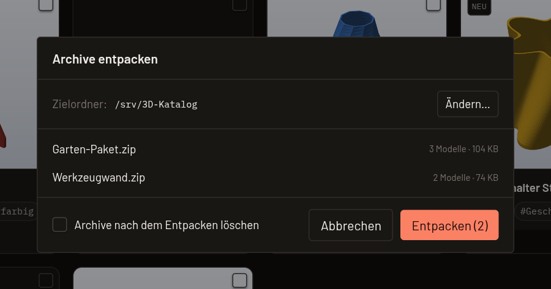

## Katalog durchsuchen und organisieren

Oben rechts neben "Importieren" wechselst du zwischen drei Ansichten: **Raster** (Bildkacheln,
siehe Screenshot oben), **Ordner** und **Liste**:

Die Liste zeigt zusätzliche Spalten (Tags, Volumen, Dateigröße) und lässt sich per Klick auf die
Spaltenüberschrift sortieren.

### Ordner-Ansicht

Die Ansicht **Ordner** gruppiert deine Modelle nach der echten Ordnerstruktur auf der Festplatte —
wie in einem Datei-Explorer, mit Unterordnern eingerückt und einer durchgehenden Verbindungslinie:

Jede Ordner-Kopfzeile zeigt die Gesamtzahl der enthaltenen Dateien, inklusive aller Unterordner.
Per Klick auf die Kopfzeile klappst du einen Ordner ein oder aus — der Zustand bleibt über einen
Neustart der App erhalten. Dateien ohne Ordner erscheinen als letzte Sektion "Ohne Ordner". Sowohl
Ordner-Kopfzeilen als auch einzelne Dateien lassen sich innerhalb dieser Ansicht direkt per Maus
verschieben, genau wie in der Seitenleiste — das Verschieben wirkt sich sofort auch auf der
Festplatte aus.

Dieselbe Gruppierung funktioniert auch in der Listen-Darstellung:

Zum Organisieren stehen dir insgesamt drei unabhängige Mechanismen zur Verfügung, die du beliebig
kombinieren kannst:

- **Ordner** (Sidebar links) — echte Verzeichnisse auf der Festplatte, siehe oben.
- **Tags** — frei vergebene Hashtags, in der Sidebar unter "Tags" gesammelt, anklickbar zum
  Filtern.
- **Sammlungen** — mehrere Modelle explizit zu einem Projekt zusammenfassen (siehe unten,
  [Sammlungen](#sammlungen)).

Über das Suchfeld oben in der Sidebar filterst du nach Name, Tag, Ersteller oder Dateipfad — ein
Treffer in irgendeinem dieser Felder reicht. Mit der Taste `/` springst du von überall aus direkt
ins Suchfeld, ohne erst mit der Maus dorthin zu klicken. Häufig genutzte Kombinationen aus
Ordner/Tag/Ersteller/Suche/Sortierung lassen sich unter einem eigenen Namen speichern und später
per Klick wieder anwenden ("Gespeicherte Filter").

**Tastaturkürzel:** `/` fokussiert die Suche, die Pfeiltasten navigieren räumlich im Raster (Hoch/
Runter springt anhand der tatsächlich sichtbaren Kachel-Position zur nächsten Zeile, Links/Rechts
zum nächsten/vorherigen Modell), die Leertaste schaltet die Mehrfachauswahl-Checkbox des gerade
ausgewählten Modells um, und Entf/Rücktaste öffnet bei aktiver Mehrfachauswahl die
Löschen-Bestätigung (siehe [Mehrfachauswahl](#schnelle-aktionen-kontextmenü-und-mehrfachauswahl)).
Keines davon greift, solange du gerade in einem Textfeld tippst.

## Ein Modell im Detail ansehen

Ein Doppelklick auf ein Modell öffnet die volle Detailseite:

Oben rechts im Vorschaubereich schaltest du zwischen **3D-Ansicht** (freies Drehen per
Maus-Ziehen, plus Auto-Rotation und 15°-Schritt-Buttons) und dem hinterlegten **Bild** um — welche
der beiden standardmäßig angezeigt wird, legst du in den Einstellungen unter "Bevorzugte Ansicht"
fest. Rechts siehst du alle Metadaten (Maße, Volumen, geschätztes Gewicht, Material, Dateigröße,
Importdatum, Ersteller), darunter ein Feld für eine **Quelle** (z. B. ein Link zur
Modell-Herkunftsseite) sowie deine Hashtags mit Möglichkeit, weitere hinzuzufügen oder zu
entfernen. Wurde die Datei bereits in OrcaSlicer oder Bambu Studio gesliced, liest die App das
reale Filamentgewicht direkt aus den Slicer-Metadaten statt es nur grob zu schätzen — inklusive
Aufschlüsselung pro Druckplatte und Filament sowie einer geschätzten Materialkosten-Summe, wenn
passende Spulen im Filament-Lager hinterlegt sind. Über den "Metadaten neu einlesen"-Knopf holst du
diese Werte nachträglich nach, falls du eine bereits katalogisierte Datei erst später im Slicer
nachgesliced hast.

Unten links kannst du das Modell als **gedruckt** markieren und es zur **Warteschlange**
hinzufügen. Mit dem **Herz** markierst du es als Favorit; alle Favoriten findest du unter
„Werkzeuge → Favoriten“.

## Schnelle Aktionen: Kontextmenü und Mehrfachauswahl

Rechtsklick auf ein Modell öffnet ein Kontextmenü mit den wichtigsten Aktionen:

Über "Umbenennen" änderst du den Dateinamen direkt im Kontextmenü — die Dateiendung wird dabei
fest angezeigt und lässt sich nicht mit wegtippen. Verschiebt der neue Name das Modell
in der Standardsortierung (nach Name) aus dem sichtbaren Bereich, scrollt die Ansicht automatisch
dorthin.

Willst du mehrere Modelle gleichzeitig bearbeiten, markierst du sie über die Checkboxen oben
links auf jeder Kachel (oder "Alle auswählen"). Eine Aktionsleiste erscheint, über die sich die
Auswahl gemeinsam zur Warteschlange oder einer Sammlung hinzufügen, mit einem Tag versehen oder
davon befreien ("Tag hinzufügen" / "Tag entfernen" — Letzteres zeigt ein Dropdown mit allen in
der Auswahl vorkommenden Tags), als gedruckt/nicht gedruckt markieren oder löschen lässt. Bei
aktiver Mehrfachauswahl öffnet auch die Taste Entf/Rücktaste direkt die Löschen-Bestätigung:

## Sammlungen

Sammlungen sind ein dritter Organisationsmechanismus neben Ordnern und Tags: Du fasst mehrere
Modelle explizit zu einem Projekt zusammen, mit einer manuell festlegbaren Reihenfolge (Drag &
Drop). Eine neue Sammlung legst du über "+ Neue Sammlung" in der Sidebar an und befüllst sie über
die Mehrfachauswahl. Ein Klick auf eine Sammlung in der Sidebar filtert den Katalog auf ihre
Modelle:

## Werkzeuge in der Seitenleiste

Unten in der Seitenleiste bündelt der Bereich **Werkzeuge** mehrere Hilfen, jeweils mit Anzahl.
Über die Überschrift lässt er sich zuklappen.

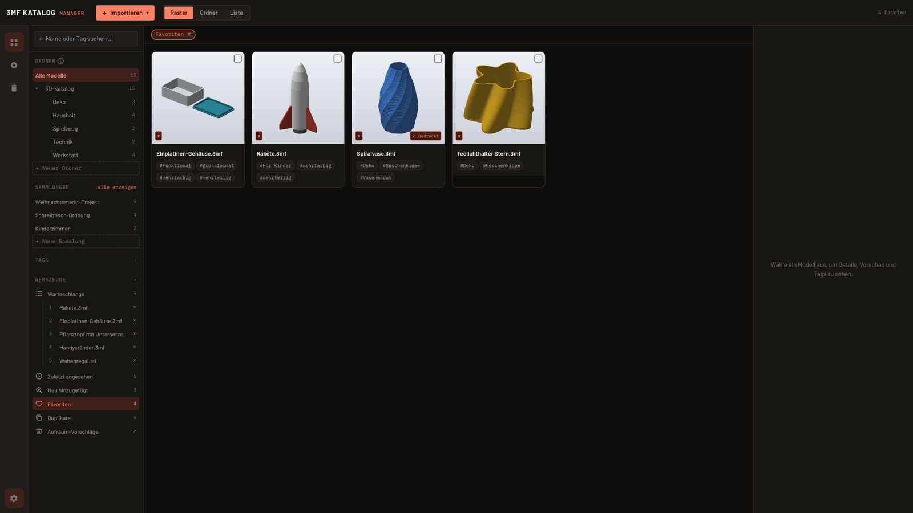

- **Warteschlange** — Modelle, die als Nächstes gedruckt werden sollen. Aufklappbar und per
  Drag & Drop sortierbar; ein Klick auf einen Eintrag zeigt das Modell an. Ein Symbol je Eintrag
  zeigt, ob dein Filament reicht (siehe [Reicht das Filament?](#reicht-das-filament)). Markierst
  du ein Modell als gedruckt, verschwindet es automatisch aus der Warteschlange.
- **Zuletzt angesehen** — die 20 zuletzt geöffneten Modelle, das neueste zuerst.
- **Neu hinzugefügt** — alles, was in den letzten 7 Tagen importiert wurde.
- **Favoriten** — alle Modelle, die du mit dem Herz markiert hast, alphabetisch sortiert.
- **Duplikate** — Modelle mit identischem Dateiinhalt, als Gruppen nebeneinander.
- **Aufräum-Vorschläge** — prüft den Katalog auf fehlende Dateien und Duplikate.

Eine gewählte Ansicht erscheint oben als Filter-Chip und lässt sich mit Ordnern, Tags und Suche
kombinieren. Ein zweiter Klick auf die Ansicht oder das ✕ am Chip hebt sie wieder auf.
Filament-Lager und Papierkorb erreichst du wie gewohnt über die Symbole in der linken Leiste.

## Modelle direkt im Slicer öffnen

Über "In Slicer öffnen" (im Detailpanel, auf der Detailseite oder im Kontextmenü) startet die App
direkt dein Slicer-Programm mit der ausgewählten Datei. Welche Slicer zur Auswahl stehen und
welcher davon dein **Standard-Slicer** ist, richtest du in den Einstellungen ein (siehe unten).

> Unter macOS funktioniert das für automatisch erkannte Slicer zuverlässig. Fügst du
> stattdessen einen Slicer manuell hinzu, musst du im Auswahldialog gezielt die Programmdatei
> **innerhalb** des `.app`-Bundles auswählen (nicht das Bundle selbst) — siehe
> [Bekannte Einschränkungen](#bekannte-einschränkungen).

## Das Filament-Lager

Das Filament-Lager ist eine eigenständige Verwaltung für deine Filamentspulen, unabhängig vom
Modell-Katalog. Du erreichst es über das zweite Symbol in der Navigationsleiste ganz links.

Oben siehst du eine Statistik-Leiste (Spulen gesamt, Restbestand gesamt, belegte Lagerplätze,
Spulen mit niedrigem/leerem Bestand). Jede Spulen-Karte zeigt Material, Hersteller, Farbe,
Lagerort, verbleibendes Gewicht als Balken und Prozentwert sowie einen Status: **Vorrätig**
(grün), **Niedrig** (orange, wenn der Bestand knapp wird) oder **Leer**. Über die
Filterknöpfe "Niedrig"/"Leer" oder das Suchfeld findest du gezielt Spulen, die bald nachbestellt
werden müssen.

Alternativ zur Kachel-Ansicht gibt es eine sortierbare Listenansicht ("Liste" neben "Dashboard"):

Über "+ Spule anlegen" öffnest du das Formular für eine neue Spule:

Neben den üblichen Angaben (Material, Hersteller, Farbe, Lagerort, Durchmesser, Preis,
Ursprungs-/Restgewicht, optional ein Foto) lässt sich hier auch die **Anzahl** angeben: Legst du
z. B. drei identische PLA-Spulen gleichzeitig an, erhält jede davon trotzdem ihren eigenen,
unabhängig verfolgten Restbestand. Gewichte speichert die App auf 0,1 g genau. Für Material,
Hersteller und Lagerort schlägt die App beim Tippen bereits verwendete Werte vor (Autocomplete).
Das Foto wählst du per Klick auf das Bildfeld aus oder ziehst es direkt aus dem Dateimanager
darauf (eine PNG-, JPG- oder WebP-Datei, höchstens 5 MB). Passt ein Bild nicht, steht der Hinweis
direkt unter dem Bildfeld und das Formular bleibt beim Speichern offen: Wähl ein anderes Bild oder
schließ den Hinweis mit ✕, um ohne dieses Bild zu speichern.

**Bearbeiten per Doppelklick:** Ein Doppelklick auf eine Karte oder eine Zeile der Liste öffnet
dasselbe Formular wie der Stift ✎.

**Nachkaufen:** Hast du eine Spule nachgekauft, die du schon im Lager hast, klick auf ihrer Karte
auf „＋ Nachkaufen" (in der Liste auf „＋" in der Zeile). Im kleinen Fenster wählst du die Anzahl
(1 bis 20) und passt bei Bedarf Menge, Preis und Lagerort an. Vorbelegt sind die Werte der
Vorlage, beim Lagerort ihr Stammplatz, falls sie gerade im Drucker steckt. Die neuen Einträge
übernehmen Art, Material, Hersteller, Farbe, Farbwert, Bild und Durchmesser, sind voll und liegen
im Lager. Danach sind sie kurz grün umrandet. Escape oder ein Klick neben das Fenster schließt es,
ohne etwas anzulegen.

**Resin:** Mit „Filament | Resin" oben im Lager wechselst du zu deinen Resin-Flaschen; die App
merkt sich die Auswahl. Übersicht, Liste, Suche und Kennzahlen zeigen dann nur Resin, Mengen in
Milliliter („Flaschen gesamt"). „Flasche anlegen" legt dort immer eine Resin-Flasche an, im
Filament-Bereich entsteht immer eine Spule. Statt des Gewichts gibst du den „Inhalt (ml)" an, einen
Durchmesser gibt es nicht, und Material und Hersteller schlagen Resin-Werte vor. Hast du Resin verbraucht,
klick auf der Flasche auf „− Verbrauch" und trag die Milliliter ein (auf 0,1 ml genau); der Rest
sinkt nie unter 0. Resin-Flaschen kommen nie in ein Filament-Fach, sondern nur in die Harzwanne
eines Resin-Druckers (siehe [Resin-Drucker](#resin-drucker)), und zählen nicht bei „Reicht das
Filament?" und den Materialkosten.

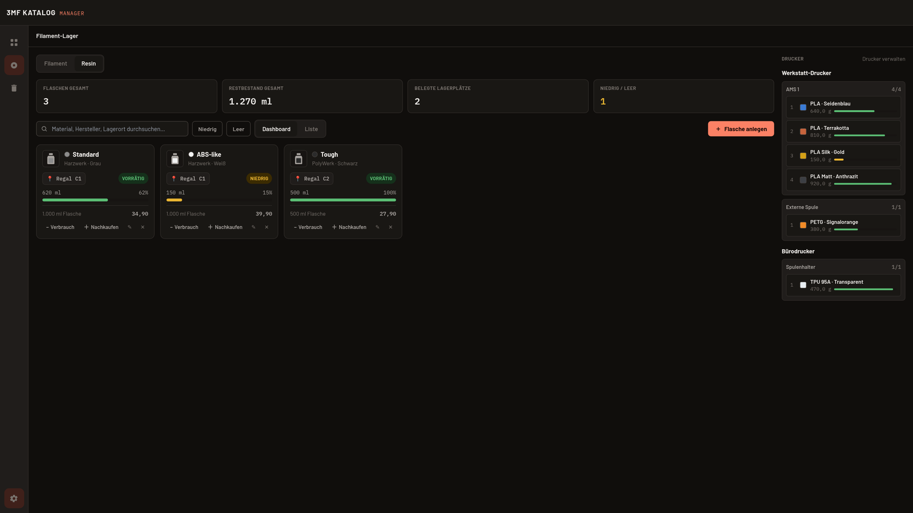

### Reicht das Filament?

Für 3MF-Dateien, die in Bambu Studio oder OrcaSlicer gesliced wurden, vergleicht die Detailseite
den Filamentbedarf (über alle Druckplatten zusammengezählt) mit deinen Spulen: gleiches Material
und ähnliche Farbe. Pro Filament siehst du einen Status:

- **reicht** — eine passende Spule hat genug Restgewicht,
- **reicht mit Spulenwechsel** — es reicht nur, wenn du unterwegs eine zweite Spule einlegst,
- **reicht nicht** — mit der fehlenden Menge,
- **unklar** — keine passende Spule gefunden oder keine Slicer-Daten.

Dazu nennt die App die passende Spule mit Restgewicht und sagt, ob sie im Drucker steckt
(Drucker · Einheit · Fach) oder wo sie liegt. Die Warteschlange zeigt denselben Status als Symbol
und rechnet von oben nach unten mit dem gemeinsamen Bedarf. Es wird dabei nichts abgebucht.

### Drucker & AMS

Neben dem Lager selbst lassen sich auch deine Drucker mit ihren Mehrfarbeinheiten abbilden —
eingelegte Spulen erscheinen dann in einer eigenen Spalte rechts neben dem Lager.

1. Über "Drucker verwalten" legst du einen Drucker an — neben dem Namen wählst du dabei
   "Filament" (Standard) oder "Resin"; die Art ist danach fest. Ein Filament-Drucker bekommt
   automatisch einen "Spulenhalter" (1 Fach); bei einem Drucker ohne AMS ist das zunächst sein einziges Fach, du
   kannst ihn aber jederzeit löschen. Über "+ Einheit hinzufügen" fügst du weitere
   Mehrfarbeinheiten hinzu — entweder aus Vorlagen (Bambu AMS/AMS lite/AMS HT, Creality CFS,
   Prusa MMU3, Anycubic ACE Pro, Spulenhalter) oder als "Eigene…" mit frei wählbarer
   Fachanzahl. Die Reihenfolge der Einheiten änderst du per Griff. Hat ein Drucker gar keine
   Fächer mehr (z. B. nach dem Löschen des Spulenhalters), zeigt seine Spalte den Hinweis
   "Keine Fächer – über „Drucker verwalten“ hinzufügen"; ein Klick darauf öffnet direkt die
   Drucker-Verwaltung.
2. Eine Spule einlegen: Karte oder Zeile aus dem Lager auf ein Fach ziehen — oder das Fach
   anklicken und eine Spule aus der Liste auswählen. Ist das Fach bereits belegt, kehrt die
   Spule, die schon im Fach steckt, an ihren Stammplatz zurück.
3. Herausnehmen: die Spule aus dem Fach zurück in den Lagerbereich ziehen, oder über das
   Fach-Menü "Herausnehmen" wählen. Sie kehrt automatisch an ihren Stammplatz zurück; im
   Hinweis dazu lässt sich der Ort noch ändern.
4. Im Spulen-Formular gibt es jetzt einen **Farbwert** (Palette oder Hex-Eingabe) zusätzlich
   zum Farbnamen; bei einer eingelegten Spule heißt das Lagerort-Feld "Stammplatz".
5. Welche Spule in welchem Fach steckt, trägst du hier weiterhin von Hand ein (Drag & Drop oder
   Fach-Menü). Was die App dir abnehmen kann, ist das Ablesen des Filamentverbrauchs nach einem
   Druck bei angebundenen Klipper/Moonraker-Druckern — siehe [Druckeranbindung](#druckeranbindung).

In der Ansicht "Filament" zeigt die rechte Spalte nur Filament-Drucker, in der Ansicht "Resin"
nur Resin-Drucker.

### Resin-Drucker

Wählst du beim Anlegen "Resin", bekommt der Drucker statt des Spulenhalters genau eine
**Harzwanne** mit Platz für eine Flasche. Sie lässt sich weder umbenennen noch löschen, und
weitere Einheiten gibt es bei Resin-Druckern nicht; den Drucker selbst kannst du umbenennen und
löschen wie jeden anderen.

- In der Ansicht "Resin" des Lagers steht der Resin-Drucker in der rechten Spalte. Die Wanne
  zeigt die eingesetzte Flasche mit Farbe, Rest in ml und Füllbalken.
- Eine Flasche setzt du ein, indem du ihre Karte oder Zeile auf die Wanne ziehst oder die Wanne
  anklickst und eine Flasche auswählst — das Menü listet nur Resin-Flaschen. Steckt schon eine
  Flasche in der Wanne, kehrt sie an ihren Stammplatz zurück.
- "Herausnehmen" (Menü der Wanne oder zurück in den Lagerbereich ziehen) bringt die Flasche an
  ihren Stammplatz zurück, wie bei Spulen.
- "− Verbrauch" gibt es für eine eingesetzte Flasche im Menü der Wanne.
- Resin-Flaschen passen nur in eine Harzwanne, Filament-Spulen nie. Ein unpassendes Ziel wird
  beim Ziehen nicht hervorgehoben, und dort loslassen bewirkt nichts.
- Resin-Drucker haben keine Druckeranbindung und zählen nicht bei „Reicht das Filament?", den
  Materialkosten und dem Warteschlangen-Symbol.
- Eine Flasche in der Wanne behält ihre Art: Sie lässt sich erst nach dem Herausnehmen zu
  Filament ändern (umgekehrt genauso bei Spulen im Fach).

### Druckeranbindung

Bei einem Klipper-Drucker mit Moonraker (z. B. über Mainsail oder Fluidd bedient) kann die App
den Filamentverbrauch fertiger und abgebrochener Drucke selbst ablesen, statt dass du ihn von
Hand einträgst. Das ist standardmäßig **ausgeschaltet** und rein lesend: Die App sendet nur
Abfragen, nie einen Befehl, und spricht nur mit Adressen, die du selbst im Heimnetz einträgst.
Für Resin-Drucker gibt es keine Anbindung: Bei ihnen fehlt der Abschnitt "Verbindung".

1. **Einstellungen → Drucker** → Schalter "Druckeranbindung" einschalten.
2. **Filament-Lager → Drucker verwalten** → beim gewünschten Drucker unter "Verbindung" die
   Adresse eintragen (dieselbe IP oder denselben Namen, mit dem du z. B. Mainsail im Browser
   öffnest) → "Verbindung testen". Klappt es, zeigt die App Version und Port sowie ab welchem
   Zeitpunkt Drucke abgebucht werden — ältere Drucke bleiben unberührt. Meldet der Drucker
   "Anmeldung nötig", ist am Drucker eine Anmeldung eingerichtet, die diese Version noch nicht
   unterstützt.
3. Danach fragt die App den Drucker beim Start, alle 5 Minuten und über den "↻"-Knopf neben
   seinem Status automatisch nach neu beendeten Drucken. Gibt es welche, erscheint im
   Filament-Lager der Hinweis "N neue Drucke warten auf Bestätigung" mit einem Knopf "Prüfen".
4. Im sich öffnenden Dialog "Neue Drucke" siehst du pro Druck den Verbrauch in Gramm, dazu je
   eine vorgeschlagene Spule (die im Drucker eingelegte, falls bekannt) und ein vorgeschlagenes
   Katalogmodell (über den Dateinamen ermittelt) — beides lässt sich ändern. Erst mit
   "Bestätigen" (einzeln oder über "Alle N bestätigen") wird das Gewicht von der Spule
   abgebucht; mit ausgewähltem Modell entsteht zusätzlich ein Eintrag im Druckprotokoll und das
   Modell wird als gedruckt markiert. "Ignorieren" verwirft den Vorschlag ohne zu buchen.

## Druckprotokoll

Zusätzlich zum einfachen Gedruckt/Nicht-gedruckt-Status kannst du zu jedem Modell ein Protokoll
mehrerer Druckversuche führen (Datum, eine Notiz, optional ein Foto) — nützlich, wenn du
dasselbe Modell mehrfach druckst und den Überblick behalten willst, welcher Versuch wann
funktioniert hat.

## Der Papierkorb

Gelöschte Modelle werden nicht sofort entfernt, sondern wandern für 7 Tage in den Papierkorb und
lassen sich in dieser Zeit wiederherstellen:

Über "Papierkorb leeren" oben rechts entfernst du alle enthaltenen Modelle sofort und endgültig.

## Einstellungen

Über das Zahnrad-Symbol unten in der Navigationsleiste öffnest du die Einstellungen. Sie sind in
fünf Reiter aufgeteilt: **Allgemein**, **Slicer**, **Katalog**, **Drucker** und **Info**.

### Allgemein

- **Erscheinungsbild** — folgt automatisch deiner Systemeinstellung, oder fest auf Hell/Dunkel
  gestellt. Direkt darunter die Dichte-Einstellung: "Kompakt" (dicht, kleine Schrift, viel auf
  einen Blick) oder "Komfort" (größere Schrift, Grafiken und Bedienelemente, deutlich lesbarer).
- **Bevorzugte Ansicht** — ob Katalog und Detailseite standardmäßig das hinterlegte Vorschaubild
  oder die gerenderte 3D-Ansicht zeigen. Fehlende Schnappschüsse werden bei Bedarf automatisch im
  Hintergrund nachgerendert.
- **Sprache** — Deutsch, Englisch, Spanisch oder Französisch, sofort wirksam ohne Neustart.

### Slicer

Die App durchsucht beim Start bekannte Installationsorte (Bambu Studio, OrcaSlicer, PrusaSlicer,
SuperSlicer, UltiMaker Cura) und trägt gefundene Slicer automatisch ein; über "+ Hinzufügen"
ergänzt du weitere, auch selbst kompilierte oder abgewandelte Versionen. Der Radiobutton legt
fest, welcher Slicer beim Öffnen eines Modells als **Standard** verwendet wird.

### Katalog

- **Katalog prüfen** — ein manuell auslösbarer Scan findet verwaiste Dateipfade (Datei im Katalog
  eingetragen, aber auf der Festplatte nicht mehr vorhanden) und Bestands-Duplikate, mit
  Bereinigung per Auswahl-Dialog.
- **Katalog-Backup** — siehe nächster Abschnitt.
- **Katalog-Speicherort** — zeigt den aktuellen Basisordner und erlaubt, ihn zu ändern oder direkt
  im Dateimanager zu öffnen.

### Drucker

Hier schaltest du die Druckeranbindung ein oder aus (standardmäßig aus) und siehst auf einen
Blick den Status jedes angebundenen Druckers ("Klipper · verbunden", "Klipper · Fehler" oder
"nicht angebunden"). Adresse und Verbindungstest trägst du pro Drucker im Filament-Lager unter
"Drucker verwalten" ein — Details dazu im Abschnitt
[Druckeranbindung](#druckeranbindung) weiter oben. Resin-Drucker erscheinen hier nicht.

### Info

Zeigt die installierte Version sowie Links zu Quellcode, Anwendungslizenz und den Lizenzen der
Drittanbieter-Komponenten. Beim Start der App wird
einmalig im Hintergrund still geprüft, ob auf GitHub eine neuere Version vorliegt — es wird
**nichts automatisch heruntergeladen**. Ist eine neuere Version verfügbar, erscheint unten rechts
ein wegklickbarer Hinweis mit einem "Herunterladen"-Knopf, der die passende Release-Seite im
Standardbrowser öffnet. Denselben Status siehst du jederzeit auch hier im Info-Tab, inklusive
einem Knopf "Erneut nach Updates suchen" für eine manuelle Prüfung.

Unten im Screenshot siehst du ein Beispiel für das **Hell**- bzw. **Dunkel**-Theme im direkten
Vergleich:

## Katalog sichern und wiederherstellen (Backup)

Über "Katalog-Backup" in den Einstellungen exportierst du deinen kompletten Katalog (Datenbank
und Einstellungen) als ZIP-Datei — praktisch vor einem Systemwechsel oder einfach als
Sicherheitskopie. Beim Wiedereinspielen einer solchen Sicherung legt die App automatisch vorher
eine Sicherung deiner bestehenden Datenbank an, sodass ein versehentlicher Import nichts
unwiderruflich überschreibt.

## Bekannte Einschränkungen

- **"In Slicer öffnen" bei manuell hinzugefügten Slicern unter macOS**: die automatische
  Slicer-Erkennung findet bei bekannten Programmen (Bambu Studio, OrcaSlicer, PrusaSlicer,
  SuperSlicer, UltiMaker Cura) bereits die richtige, direkt ausführbare Programmdatei innerhalb
  des `.app`-Bundles — für diese funktioniert "In Slicer öffnen" zuverlässig. Fügst du stattdessen
  einen Slicer manuell hinzu, musst du im macOS-Dateidialog gezielt zur Programmdatei
  `<Name>.app/Contents/MacOS/<Name>` navigieren (mit ⌘⇧G lässt sich der Pfad direkt eintippen),
  da ein `.app`-Bundle selbst kein direkt ausführbares Ding im technischen Sinn ist.
- Die macOS- und Windows-Installationspakete sind **unsigniert** — Gatekeeper bzw. SmartScreen
  warnen beim ersten Start (siehe [Installation](#installation) für den Weg drumherum).
- Es gibt **keine Cloud-Anbindung** — der Katalog ist bewusst rein lokal, eine frühere
  Google-Drive-Anbindung wurde wieder entfernt, weil sie im Alltag zu instabil war.

## Häufige Fragen (FAQ)

**Warum sehe ich bei manchen Modellen nur ein gepunktetes Muster statt eines Vorschaubilds?**
Das Modell hat weder ein eigenes hochgeladenes Bild, noch ein in der Datei eingebettetes
Thumbnail, noch wurde bisher ein 3D-Schnappschuss dafür erzeugt. Öffne das Modell einmal in der
3D-Ansicht, oder lade unter "Bild hochladen" auf der Detailseite ein eigenes Bild hoch.

**Ich habe eine Datei versehentlich gelöscht — ist sie weg?**
Nein, solange keine 7 Tage vergangen sind: Sie liegt im Papierkorb und lässt sich von dort
wiederherstellen.

**Wie bekomme ich meine vorhandene Ordnerstruktur in den Katalog?**
Bei der Ersteinrichtung "Bestehende Ordnerstruktur übernehmen" wählen (siehe
[Erste Schritte](#erste-schritte)), oder später über "Katalog-Speicherort" in den Einstellungen.

**Kann ich denselben Katalog auf mehreren Rechnern nutzen?**
Nicht automatisch/synchronisiert — dafür gibt es aktuell keine Cloud-Anbindung (siehe
[Bekannte Einschränkungen](#bekannte-einschränkungen)). Über "Katalog-Backup" (Export/Import)
lässt sich der Katalog aber manuell auf einen anderen Rechner übertragen.

**Warum wirkt das Feld "Quelle" auf manchen Systemen etwas seltsam, wenn keine URL hinterlegt
ist?** Das ist lediglich ein Platzhaltertext ("https://…") mit einem kleinen Stift-Symbol zum
Bearbeiten daneben — je nach installierten Schriftarten auf deinem System kann dieses Symbol
etwas anders aussehen, das ist kein Fehler.

---

# User Guide — 3MF Katalog Manager

This guide is for anyone using the 3MF Katalog Manager for the first time and not yet familiar
with the app. It walks you step by step through importing, organizing, and preparing your models
for printing, and managing your filament stock.

> **About the screenshots in this guide:** all screenshots show the app (version 0.13.0; the first
> three filament stock images and the resin image version 0.13.1) with its interface set to English
> and a made-up demo catalog (models like "Rocket" or "Spiral Vase", made-up filament spools, resin
> bottles and brands) — no real user data. The layout is exactly what you'll see in the app; only
> the content is for demonstration purposes.

## Contents

1. [What is the 3MF Katalog Manager?](#what-is-the-3mf-katalog-manager)
2. [Installation](#installation-1)
3. [Getting started](#getting-started)
4. [Interface overview](#interface-overview)
5. [Importing files](#importing-files)
6. [Browsing and organizing your catalog](#browsing-and-organizing-your-catalog)
7. [Viewing a model in detail](#viewing-a-model-in-detail)
8. [Quick actions: context menu and multi-select](#quick-actions-context-menu-and-multi-select)
9. [Collections](#collections)
10. [Tools in the sidebar](#tools-in-the-sidebar)
11. [Opening models directly in your slicer](#opening-models-directly-in-your-slicer)
12. [The filament stock](#the-filament-stock)
13. [Print log](#print-log)
14. [The trash](#the-trash)
15. [Settings](#settings)
16. [Backing up and restoring your catalog](#backing-up-and-restoring-your-catalog)
17. [Known limitations](#known-limitations)
18. [Frequently asked questions (FAQ)](#frequently-asked-questions-faq)

---

## What is the 3MF Katalog Manager?

The 3MF Katalog Manager is a desktop application for keeping a large collection of 3D-printing
files (`.3mf`, `.stl`, `.obj`, and CAD source files in `.stp`/`.step` format) organized: with preview images, folders, tags, search, a dedicated
stock manager for your filament spools, and a one-click way to open a model in your slicer of
choice. In the variant with STEP preview (see [Installation](#installation-1)), Open CASCADE also
provides a 3D preview and extracts dimensions, volume, and body count from STEP files. Everything
runs locally on your machine — there's no cloud connection, and your data never leaves your
computer.

## Installation

The app is available for Linux, Windows, and macOS (see the project's
[releases page](https://github.com/Bexxs75/3mf-katalog-manager/releases)). For each platform there
are two variants:

- Filename **with** the `-step` suffix: includes the 3D preview for STEP files (`.stp`/`.step`),
  at the cost of a larger download.
- Filename **without** that suffix: smaller download; STEP files can still be cataloged (tags,
  search, rename, trash), just without the 3D preview.

Otherwise the two variants are identical. If you don't use STEP files, the smaller variant without
`-step` is the safe choice.

- **Linux:** extract the `.tar.gz` archive, make the included `.AppImage` file executable, and
  run it.
- **Windows:** run the `.msi` installer. The package is unsigned (no Windows code-signing
  certificate) — SmartScreen will warn on first launch. Click "More info" → "Run anyway" to
  continue.
- **macOS:** open the `.dmg` file and drag the app into your Applications folder. This package is
  also unsigned (no Apple Developer certificate) — Gatekeeper will block the first launch.
  Right-click the app → "Open" and confirm in the dialog to start it anyway.

## Getting started

The very first time you launch the app, it asks how your catalog should be organized:

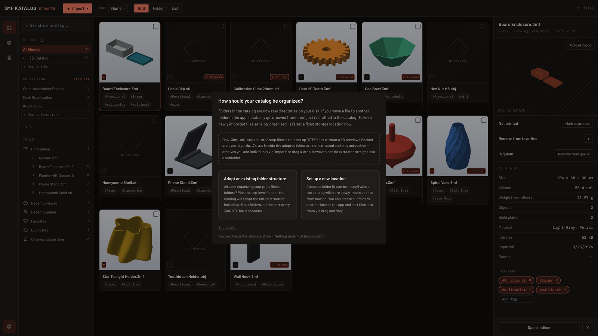

As of this app version, folders in the catalog correspond to real directories on your hard
drive — if you move a file to another folder inside the app, it's actually moved there, not just
re-sorted within the catalog. You have two options:

- **Use existing folder structure** — if you already organize your print files in folders,
  choose the top-level folder. The catalog adopts the complete structure including
  subfolders and automatically imports every `.3mf`/`.stl`/`.obj`/`.stp`/`.step` file it contains.
- **Set up a new location** — pick a (possibly empty) folder where the catalog will store newly
  imported files from now on.

You can change this choice at any time in Settings under "Catalog location". The dialog can also
be skipped via "Set up later".

Already-packed archives (e.g. `.zip`) are not picked up by the automatic scan and are left
untouched — unpack them first if needed, or open the folder directly from the catalog via your
file manager afterwards.

## Interface overview

- **Far left, the narrow navigation rail:** switches between the catalog, the filament stock, and
  the trash (with an item-count badge). The gear icon for Settings sits at the very bottom.
- **Sidebar:** a search field, followed by your folder tree with a model count per folder, your
  collections, your tags, and your print queue.
- **Main area:** your catalog as a grid (tiles with a preview image) or a list, switchable, plus
  sorting and the "Import" button top left.
- **Detail panel on the right:** shows the preview and metadata of the currently selected model,
  including quick actions like "Printed"/"Add to queue".

## Importing files

The red "+ Import" button top left offers several ways in: pick individual files via a dialog,
import an entire folder (including subfolders), or drag files straight from your file manager
into the catalog window. On import, dimensions, volume, object count, and (if present in the
file) material information are extracted automatically, and the app suggests matching hashtags
that you're free to edit afterwards. Automatically assigned tags such as "multipart", "mini",
"large" and "multicolor" appear in the interface language you selected; search finds them under
both names.

If the app imports a file that's already present in the catalog content-wise (an exact duplicate
check via content hash), it's recognized instead of being added a second time.

### Extracting archives

If you import or drag in a single archive (`.zip`, `.7z`, `.rar`, `.tar`, `.tar.gz`/`.tgz`,
`.tar.bz2`, `.tar.xz`, `.tar.zst`) instead of individual model files, a dialog opens before the
actual import:

- **Target folder** — prefilled with the active catalog folder or your storage location, changeable
  via "Change…". Each archive gets its own subfolder inside it. Only catalog folders or a folder
  chosen in one of the app's folder-selection dialogs (e.g. via "Change…") can be the target; folders that contain protected locations — such as your
  home directory itself — are rejected as a target (pick a subfolder instead, e.g. `~/3D-Prints`).
- **Conflict when the subfolder already exists** — choose between "Create new numbered folder" and
  "Merge" (existing files stay unchanged; skipped ones are counted in the result).
- **"Delete archives after extraction" checkbox** — off by default. When enabled, the original
  archive is only deleted if everything was actually extracted. If something was not extracted
  (blocked file types, unsafe entries, or files that already existed when merging), the archive
  stays in place — the result banner names the reason.
- **Grayed-out rows** — archives with no models inside, that are corrupted, encrypted, or in an
  unsupported format are shown grayed out in the list and are automatically skipped during
  extraction.

If checking the archive fails outright (for example because it was changed or deleted in the
meantime), no dialog opens — instead the result banner shows "<name> failed: <error>" until you
dismiss it.

For security reasons, programs, scripts, and shortcuts inside archives are never extracted;
password-protected and multi-part archives are detected but not extracted. If a RAR archive contains a
single file over 1 GB, the whole archive fails (anything already extracted is removed again). File
references in RAR archives (created with `rar -oi`) are not resolved: they are skipped, created as an
empty file, or make the whole archive fail on a checksum error. Folder import still does not extract any archives it contains.

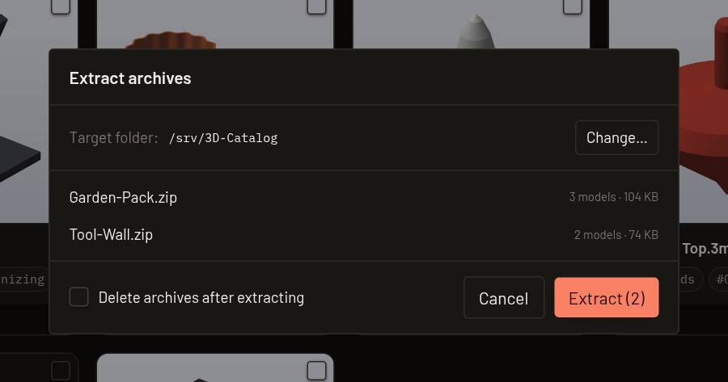

## Browsing and organizing your catalog

Top right, next to "Import", you switch between three views: **grid** (image tiles, see the
screenshot above), **folder**, and **list**:

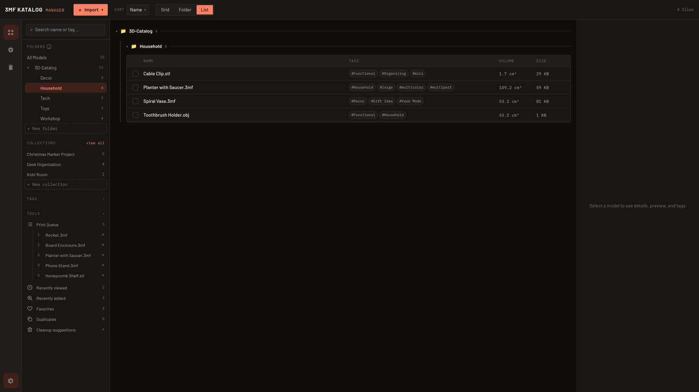

The list shows additional columns (tags, volume, file size) and can be sorted by clicking a
column header.

### Folder view

The **Folder** view groups your models by their real folder structure on disk — like a file
explorer, with subfolders indented and a continuous connecting line:

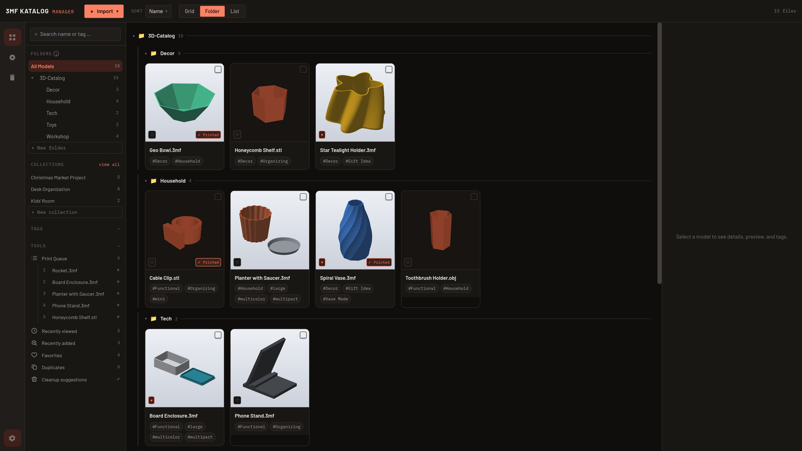

Each folder header shows the total number of files it contains, including all subfolders.
Clicking a header collapses or expands that folder — the state persists across app restarts.
Files with no folder appear as a final "No folder" section. Both folder headers and individual
files can be dragged directly within this view, exactly like in the sidebar — moving something
here also moves it on disk immediately.

The same grouping is available in list form:

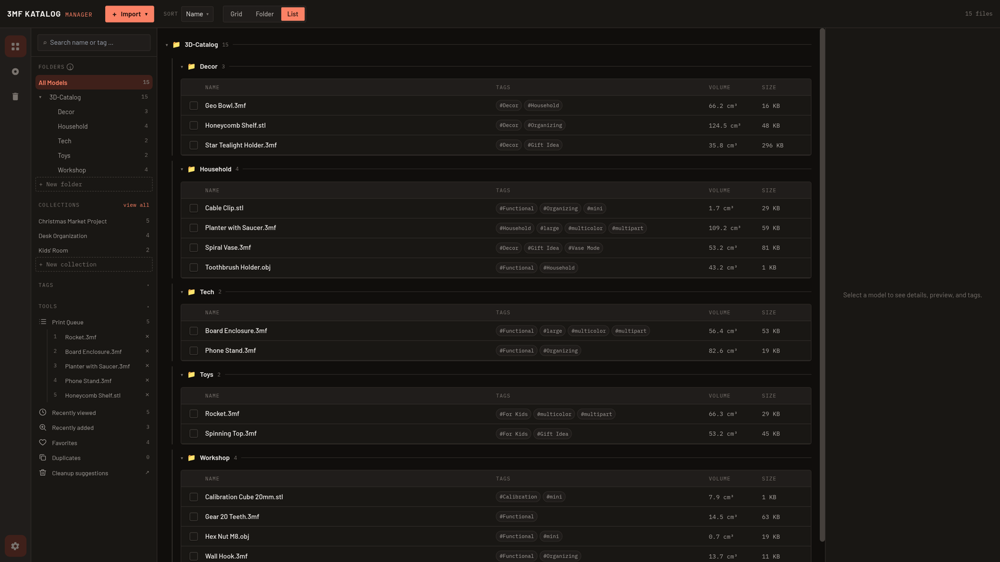

Three independent mechanisms are available for organizing your catalog overall, and you can
combine them freely:

- **Folders** (sidebar, left) — real directories on disk, see above.
- **Tags** — freely assigned hashtags, collected under "Tags" in the sidebar, clickable to
  filter.
- **Collections** — explicitly group several models into a project (see
  [Collections](#collections) below).

The search field at the top of the sidebar filters by name, tag, creator, or file path — a match
in any of these is enough. Press `/` from anywhere to jump straight into the search field without
first clicking it. Frequently used combinations of folder/tag/creator/search/sort can be saved
under a name and reapplied later with a click ("Saved filters").

**Keyboard shortcuts:** `/` focuses search, the arrow keys navigate the grid spatially (Up/Down
jumps to the next row based on actual rendered tile position, Left/Right to the next/previous
model), Space toggles the multi-select checkbox of the currently selected model, and Delete/
Backspace opens the delete confirmation when a multi-selection is active (see
[Multi-select](#quick-actions-context-menu-and-multi-select)). None of these fire while you're
typing in a text field.

## Viewing a model in detail

Double-clicking a model opens the full detail page:

Top right in the preview area, you switch between the **3D view** (free rotation by dragging with
the mouse, plus auto-rotation and 15°-step buttons) and the stored **image** — which of the two
is shown by default is set in Settings under "Preferred view". On the right you'll find all
metadata (dimensions, volume, estimated weight, material, file size, import date, creator),
followed by a **source** field (e.g. a link to the model's origin page) and your hashtags, with
the option to add or remove more. If the file has already been sliced in OrcaSlicer or Bambu
Studio, the app reads the real filament weight straight from the slicer's metadata instead of
only roughly estimating it — including a breakdown per print plate and filament, plus an
estimated material-cost total if matching spools are on record in the filament stock. The
"Re-scan metadata" button re-fetches these values later on, in case you sliced an already
cataloged file after the fact.

At the bottom left you can mark the model as **printed** and add it to the **queue**. The **heart**
marks it as a favorite; you find all favorites under "Tools → Favorites".

## Quick actions: context menu and multi-select

Right-clicking a model opens a context menu with the most important actions:

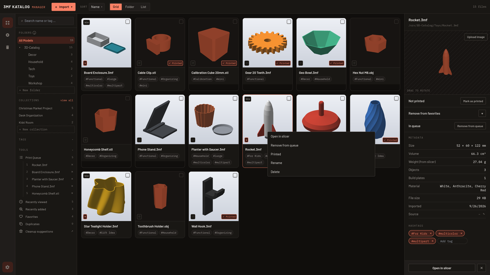

Use "Rename" to change the file name right in the context menu — the file extension is shown
fixed and can't be typed away. If the new name moves the model out of the visible area
under the default name sort, the view scrolls to it automatically.

To edit several models at once, select them via the checkboxes at the top left of each tile (or
"Select all"). An action bar appears, letting you add the whole selection to the queue or a
collection, add or remove a tag ("Add tag" / "Remove tag" — the latter shows a dropdown listing
every tag present in the selection), mark it printed/not printed, or delete it together. With a
multi-selection active, the Delete/Backspace key also opens the delete confirmation directly:

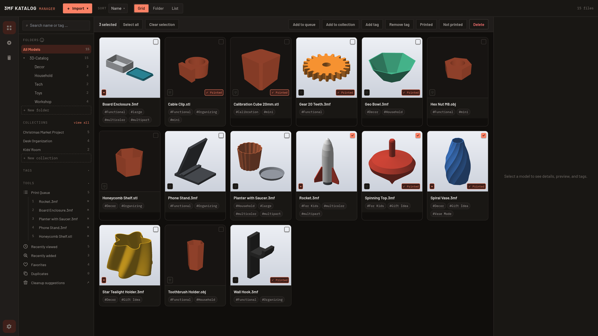

## Collections

Collections are a third organizational mechanism alongside folders and tags: you explicitly
group several models into a project, with a manually definable order (drag & drop). Create a new
collection via "+ New collection" in the sidebar and populate it via multi-select. Clicking a
collection in the sidebar filters the catalog down to its models:

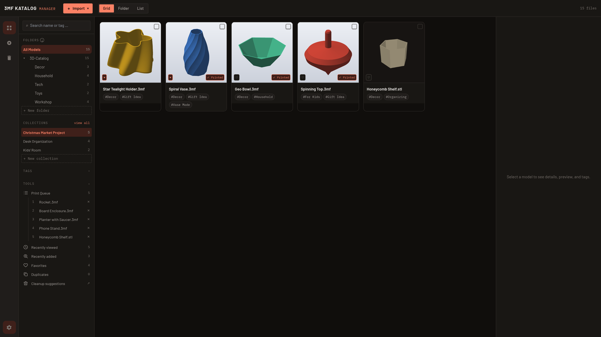

## Tools in the sidebar

At the bottom of the sidebar, the **Tools** section bundles several helpers, each with a count.
Click its heading to collapse it.

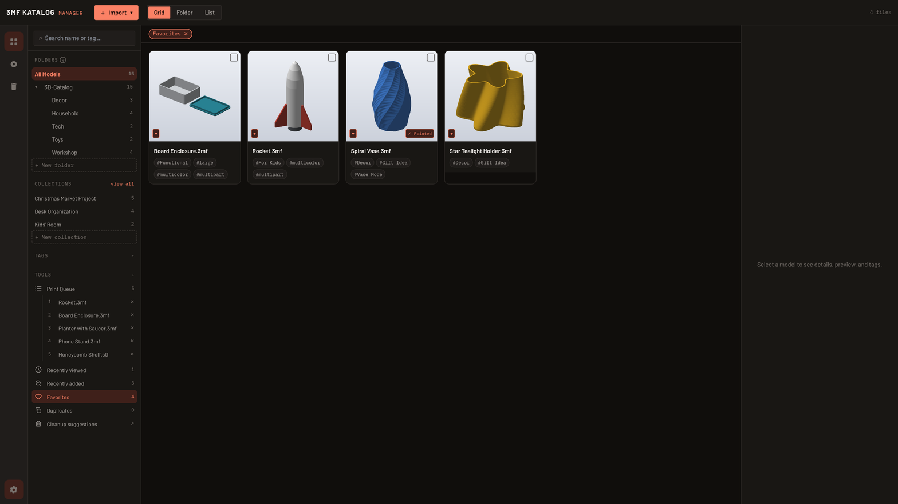

- **Print Queue** — models you plan to print next. Collapsible and sortable via drag & drop;
  clicking an entry shows the model. An icon per entry tells you whether your filament is enough
  (see [Is there enough filament?](#is-there-enough-filament)). Marking a model as printed automatically removes
  it from the queue.
- **Recently viewed** — the 20 most recently opened models, newest first.
- **Recently added** — everything imported in the last 7 days.
- **Favorites** — all models you marked with the heart, sorted alphabetically.
- **Duplicates** — models with identical file content, shown side by side as groups.
- **Cleanup suggestions** — checks the catalog for missing files and duplicates.

A selected view appears as a filter chip at the top and can be combined with folders, tags and
search. Clicking the view again or the ✕ on the chip removes it. Filament storage and trash are
still reached via the icons in the left rail.

## Opening models directly in your slicer

"Open in slicer" (available in the detail panel, on the detail page, and in the context menu)
launches your slicer program directly with the selected file. Which slicers are available, and
which of them is your **default slicer**, is configured in Settings (see below).

> On macOS, this works reliably for automatically detected slicers. If you add a slicer
> manually instead, you need to select the program file **inside** the `.app` bundle in the
> picker (not the bundle itself) — see [Known limitations](#known-limitations).

## The filament stock

The filament stock is an independent manager for your filament spools, separate from the model
catalog. You reach it via the second icon in the navigation rail on the far left.

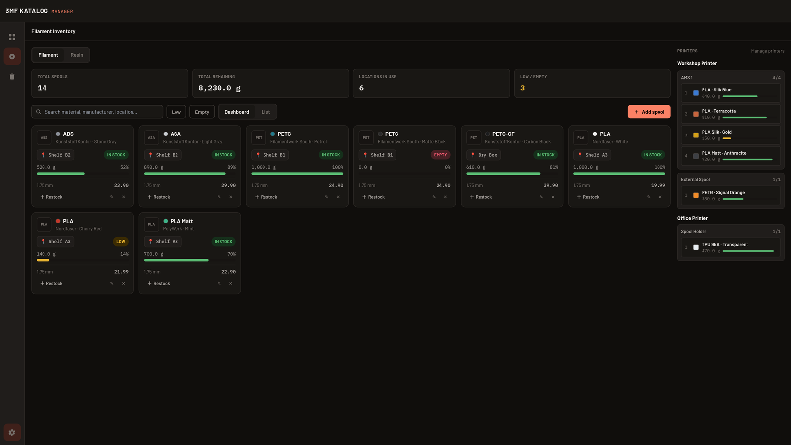

At the top is a stats bar (total spools, total remaining weight, occupied storage locations,
spools with low/empty stock). Each spool card shows material, manufacturer, color, storage
location, remaining weight as a bar and percentage, and a status: **In stock** (green), **Low**
(orange, once stock is running low), or **Empty**. The "Low"/"Empty" filter buttons or the search
field help you find spools that need reordering soon.

As an alternative to the tile view, there's a sortable list view ("List" next to "Dashboard"):

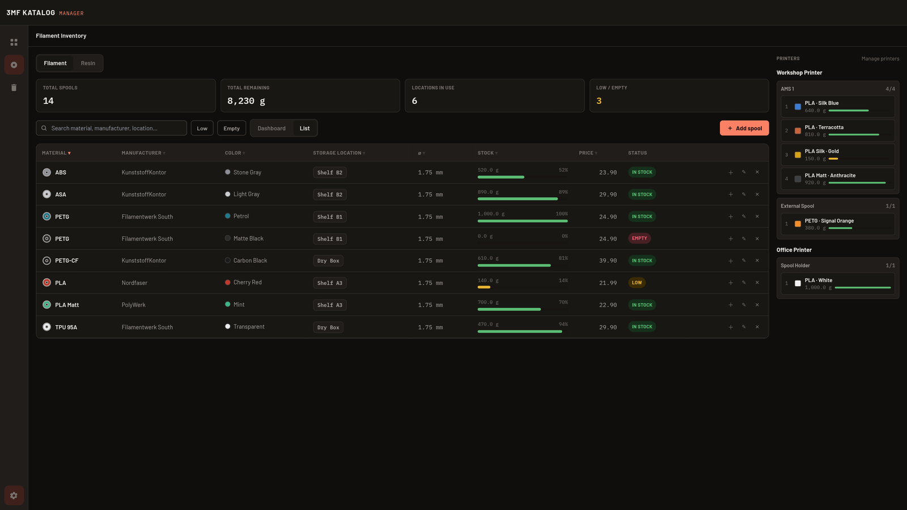

"+ Add spool" opens the form for a new spool:

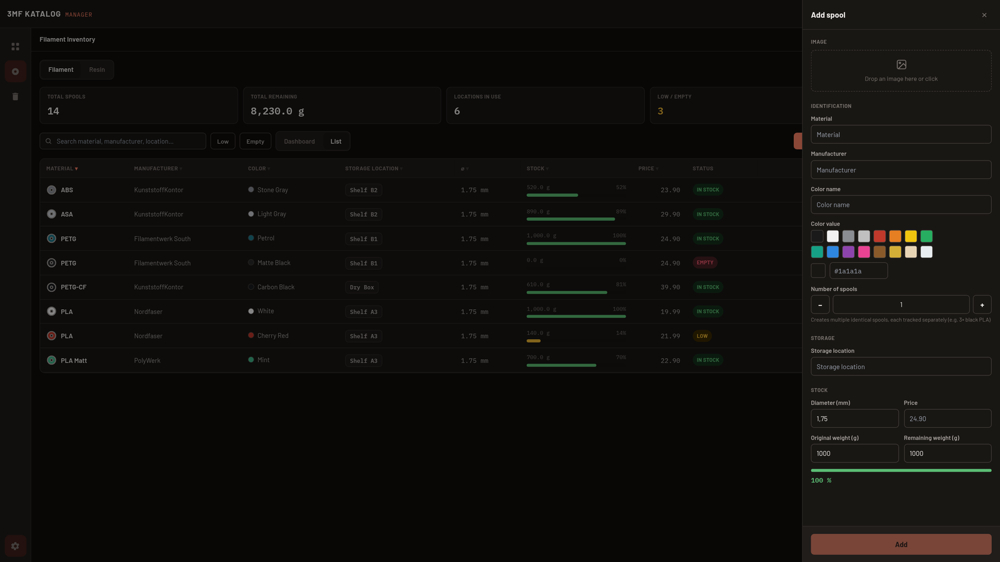

Besides the usual fields (material, manufacturer, color, storage location, diameter, price,
original/remaining weight, optionally a photo), you can also set a **quantity** here: adding,
say, three identical PLA spools at once still gives each one its own, independently tracked
remaining weight. Weights are stored to 0.1 g. For material, manufacturer, and storage location,
the app suggests previously used values as you type (autocomplete). Pick the photo by clicking
the image field, or drag it straight from your file manager onto the field (one PNG, JPG or WebP
file, up to 5 MB). If an image doesn't fit, the notice appears right below the image field and
the form stays open when you save: choose another image or close the notice with ✕ to save
without it.

**Edit with a double-click:** Double-clicking a card or a row in the list opens the same form as
the pencil ✎.

**Restock:** When you've bought more of a spool you already have in stock, click "＋ Restock" on
its card (in the list: "＋" in the row). In the small window, choose the quantity (1 to 20) and
adjust amount, price and storage location if needed. They are prefilled from the template; the
storage location is its home location if it currently sits in a printer. The new entries copy
type, material, manufacturer, color, color value, image and diameter, are full and go to storage.
Afterwards they get a brief green outline. Escape or a click outside the window closes it without
adding anything.

**Resin:** Use "Filament | Resin" at the top of the stock to switch to your resin bottles; the
app remembers your choice. Overview, list, search and stats then show only resin, with amounts in
milliliters ("Total bottles"). "Add bottle" there always creates a resin bottle, while the
filament area always creates a spool. Instead of the weight you enter the "Volume (ml)", there is
no diameter, and material and manufacturer suggest resin values. When you've used resin, click
"− Use" on the bottle and enter the milliliters (to 0.1 ml); the remaining amount never drops
below 0. Resin bottles never go into a filament slot, only into the resin vat of a resin printer
(see [Resin printers](#resin-printers)), and are left out of "Is there enough filament?" and the
material cost.

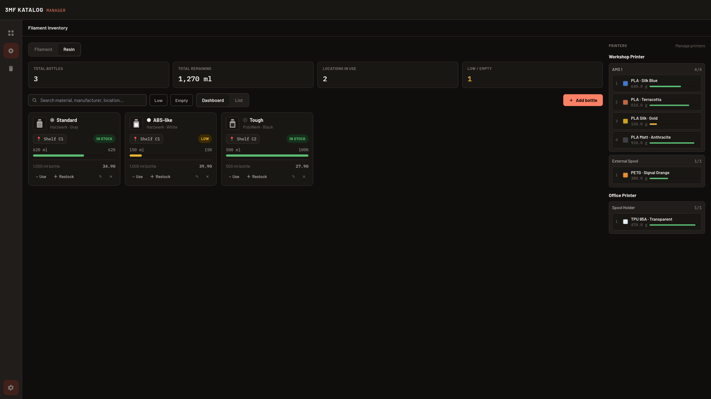

### Is there enough filament?

For 3MF files sliced in Bambu Studio or OrcaSlicer, the detail page compares the filament needed
(summed over all plates) with your spools: same material and similar color. For each filament
you see a status:

- **enough** — a matching spool has enough remaining weight,
- **enough with spool change** — only enough if you load a second spool along the way,
- **not enough** — with the missing amount,
- **unclear** — no matching spool found or no slicer data.

The app also names the matching spool with its remaining weight and tells you whether it is in a
printer (printer · unit · slot) or where it is stored. The print queue shows the same status as an
icon and calculates top to bottom with the combined need. Nothing is deducted.

### Printers & AMS

Besides the stock itself, you can also model your printers and their multi-material units —
loaded spools then appear in their own column to the right of the stock.

1. Use "Manage printers" to add a printer — next to the name you choose "Filament" (default)
   or "Resin"; the kind can't be changed afterwards. A filament printer automatically gets a
   "Spool holder" unit (1 slot); for a printer without an AMS this is initially its only slot, but you can delete it
   at any time. Then add more multi-material units to it via "+ Add unit" — either from
   templates (Bambu AMS/AMS lite/AMS HT, Creality CFS, Prusa MMU3, Anycubic ACE Pro, Spool
   holder) or as "Custom…" with any slot count you like. Reorder units by their drag handle. If
   a printer ends up with no slots at all (e.g. after deleting its spool holder), its column
   shows the hint "No slots – add them via “Manage printers”"; clicking it opens printer
   management directly.
2. Loading a spool: drag a card or row from the stock onto a slot — or click the slot and pick
   a spool from the list. If the slot is already occupied, the spool already in it returns to
   its home location.
3. Unloading: drag the spool from the slot back into the stock area, or choose "Unload" from
   the slot's menu. It automatically returns to its home location; the notice lets you change
   that location.
4. The spool form now has a **color value** (palette or hex input) in addition to the color
   name; for a loaded spool, the storage-location field is labeled "Home location".
5. Which spool is in which slot is still something you enter by hand here (drag & drop or the
   slot menu). What the app can take off your hands is reading the filament used after a print
   on connected Klipper/Moonraker printers — see [Printer connection](#printer-connection).

In the "Filament" view the right-hand column only shows filament printers, in the "Resin" view
only resin printers.

### Resin printers

If you choose "Resin" when adding a printer, it gets exactly one **resin vat** with room for one
bottle instead of the spool holder. The vat can't be renamed or deleted, and resin printers
can't have any other units; the printer itself can be renamed and deleted like any other.

- In the "Resin" view of the stock, the resin printer appears in the right-hand column. The vat
  shows the inserted bottle with its color, the remaining ml and a fill bar.
- To insert a bottle, drag its card or row onto the vat, or click the vat and pick a bottle —
  the menu only lists resin bottles. If the vat already holds a bottle, that one returns to its
  home location.
- "Unload" (vat menu, or drag it back into the stock area) returns the bottle to its home
  location, just like spools.
- "− Use" is available for an inserted bottle in the vat's menu.
- Resin bottles only fit into a resin vat, filament spools never do. A target that doesn't fit
  isn't highlighted while dragging, and dropping there does nothing.
- Resin printers have no printer connection and are left out of "Is there enough filament?",
  the material cost and the queue icon.
- A bottle in the vat keeps its kind: you can only change it to filament after unloading it
  (and the same goes for spools in a slot).

### Printer connection

With a Klipper printer running Moonraker (e.g. controlled via Mainsail or Fluidd), the app can
read the filament used by finished and aborted prints itself, instead of you entering it by
hand. This is **off by default** and read-only: the app only sends queries, never a command, and
only talks to addresses you enter yourself on your home network.
Resin printers can't be connected: they have no "Connection" section.

1. **Settings → Printers** → switch on "Printer connection".
2. **Filament stock → Manage printers** → for the printer you want, enter the address under
   "Connection" (the same IP or name you'd use to open Mainsail in a browser) → "Test
   connection". If it works, the app shows the version and port, plus the point in time from
   which prints will be deducted — older prints are left alone. If the printer reports "Login
   required", it has a login set up that this version doesn't support yet.
3. After that, the app automatically asks the printer for newly finished prints at startup,
   every 5 minutes, and via the "↻" button next to its status. If there are any, the filament
   stock shows the hint "N new prints waiting for confirmation" with a "Review" button.
4. In the "New prints" dialog that opens, you see the usage in grams per print, plus a
   suggested spool (the one loaded in the printer, if known) and a suggested catalog model
   (matched from the file name) — both can be changed. Only "Confirm" (individually or via
   "Confirm all N") deducts the weight from the spool; with a model selected, this also adds a
   print log entry and marks the model as printed. "Ignore" discards the suggestion without
   booking anything.

## Print log

In addition to the simple printed/not-printed status, you can keep a log of multiple print
attempts per model (date, a note, optionally a photo) — useful if you print the same model
repeatedly and want to keep track of which attempt worked and when.

## The trash

Deleted models aren't removed immediately — they move to the trash for 7 days and can be restored
during that time:

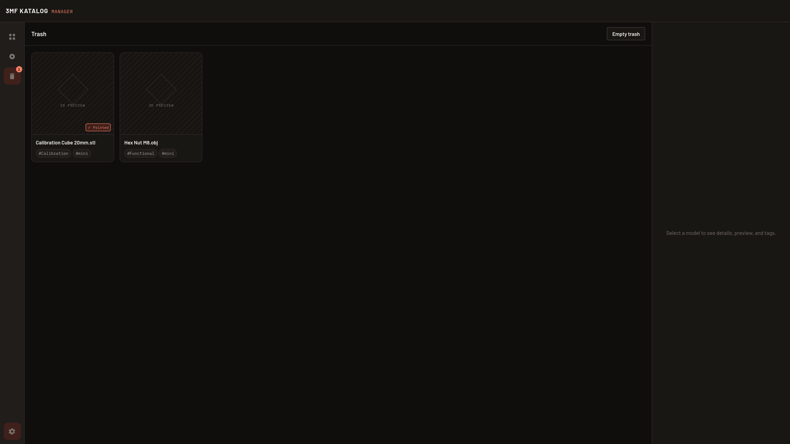

"Empty trash" top right removes everything it contains immediately and permanently.

## Settings

The gear icon at the bottom of the navigation rail opens Settings. They're split into five tabs:
**General**, **Slicer**, **Catalog**, **Printers**, and **Info**.

### General

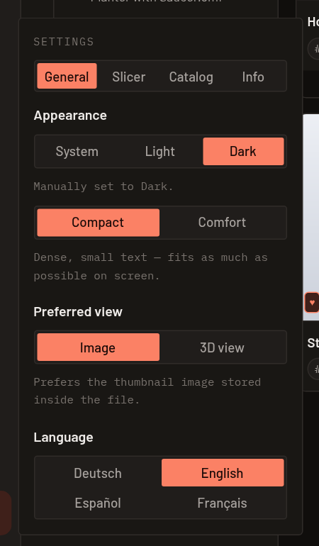

- **Appearance** — follows your system setting automatically, or fixed to light/dark. Right below
  it, the density setting: "Compact" (dense, small text, a lot at a glance) or "Comfort" (larger
  text, graphics, and controls, noticeably easier to read).
- **Preferred view** — whether the catalog and the detail page default to the stored preview
  image or the rendered 3D view. Missing snapshots are automatically re-rendered in the
  background as needed.
- **Language** — German, English, Spanish, or French, effective immediately without a restart.

### Slicer

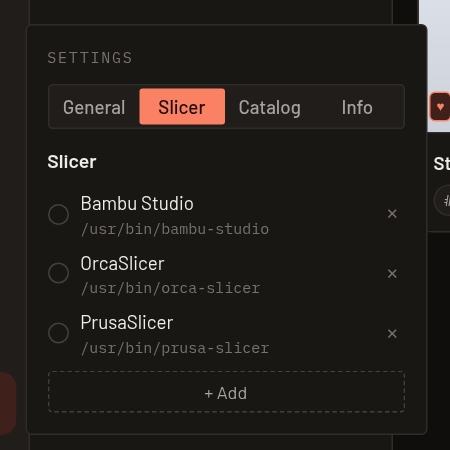

The app scans known install locations on startup (Bambu Studio, OrcaSlicer, PrusaSlicer,
SuperSlicer, UltiMaker Cura) and adds any it finds automatically; use "+ Add" to add others,
including self-built or modified versions. The radio button sets which slicer is used as the
**default** when opening a model.

### Catalog

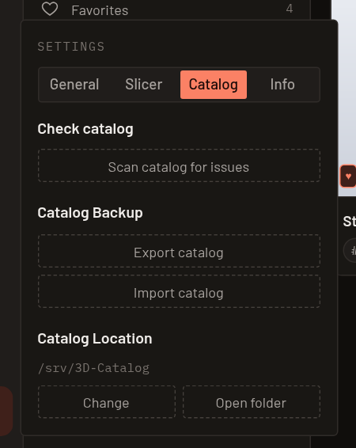

- **Check catalog** — a manually triggered scan finds orphaned file paths (a file listed in the
  catalog but no longer present on disk) and inventory duplicates, with cleanup via a selection
  dialog.
- **Catalog backup** — see the next section.
- **Catalog location** — shows the current base directory and lets you change it or open it
  directly in the file manager.

### Printers

This is where you switch the printer connection on or off (off by default) and see the status
of every connected printer at a glance ("Klipper · connected", "Klipper · error", or "not
connected"). Address and connection test are entered per printer in the filament stock under
"Manage printers" — see the [Printer connection](#printer-connection) section above for
details. Resin printers don't appear here.

### Info

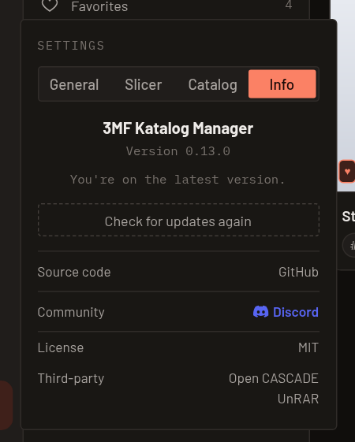

Shows the installed version plus links to the source code, application license, and third-party
licenses. On startup, the app
silently checks once in the background whether a newer version is available on GitHub —
**nothing is downloaded automatically**. If a newer version exists, a dismissible hint appears
bottom-right with a "Download" button that opens the matching release page in your default
browser. You can check the same status here in the Info tab any time, including a "Check for
updates" button for a manual check.

Below in the screenshot, you can see an example of the **light** vs. **dark** theme side by side:

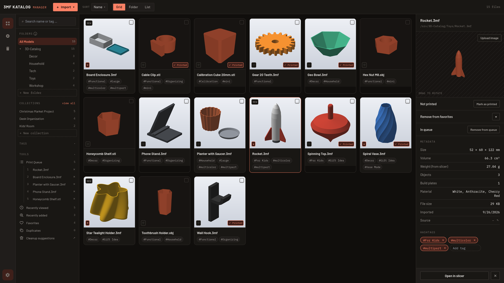
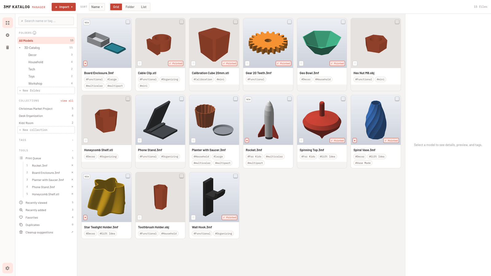

## Backing up and restoring your catalog

"Catalog backup" in Settings exports your complete catalog (database and settings) as a ZIP
file — handy before switching systems or simply as a safety copy. When restoring such a backup,
the app automatically backs up your existing database first, so an accidental import never
overwrites anything irreversibly.

## Known limitations

- **"Open in slicer" for manually added slicers on macOS**: automatic slicer detection already
  finds the correct, directly executable program file inside the `.app` bundle for known programs
  (Bambu Studio, OrcaSlicer, PrusaSlicer, SuperSlicer, UltiMaker Cura) — "Open in slicer" works
  reliably for those. If you add a slicer manually instead, you need to navigate the macOS file
  picker to `<Name>.app/Contents/MacOS/<Name>` (⌘⇧G lets you type the path directly), since a
  `.app` bundle itself isn't a directly executable thing in the technical sense.
- The macOS and Windows installer packages are **unsigned** — Gatekeeper and SmartScreen
  respectively will warn on first launch (see [Installation](#installation-1) for the way around
  it).
- There is **no cloud connection** — the catalog is deliberately local-only; an earlier Google
  Drive integration was removed again because it was too unstable in everyday use.

## Frequently asked questions (FAQ)

**Why do some models show only a dotted pattern instead of a preview image?**
The model has neither an uploaded image of its own, nor a thumbnail embedded in the file, nor has
a 3D snapshot been generated for it yet. Open the model in the 3D view once, or upload your own
image via "Upload image" on the detail page.

**I accidentally deleted a file — is it gone?**
No, as long as fewer than 7 days have passed: it sits in the trash and can be restored from
there.

**How do I get my existing folder structure into the catalog?**
Choose "Use existing folder structure" during initial setup (see
[Getting started](#getting-started)), or later via "Catalog location" in Settings.

**Can I use the same catalog on multiple computers?**
Not automatically/synced — there's currently no cloud connection for that (see
[Known limitations](#known-limitations)). But "Catalog backup" (export/import) lets you transfer
the catalog to another computer manually.

**Why does the "Source" field look a bit odd on some systems when no URL is set?**
That's just placeholder text ("https://…") with a small pencil icon next to it for editing —
depending on the fonts installed on your system, that icon may render slightly differently. It's
not a bug.
